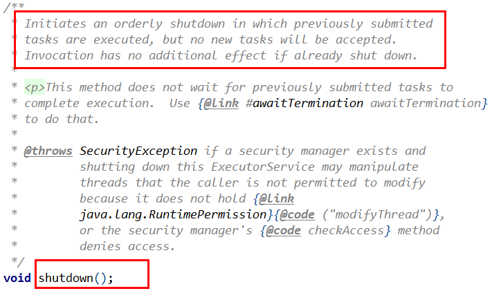
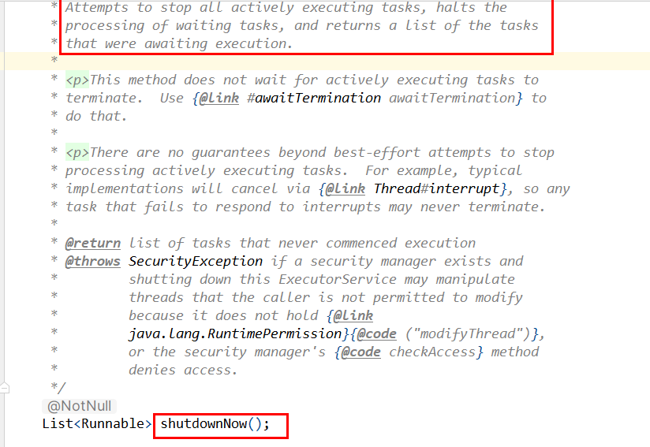
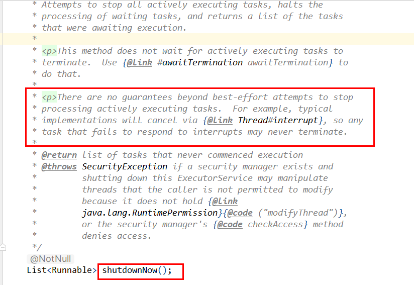
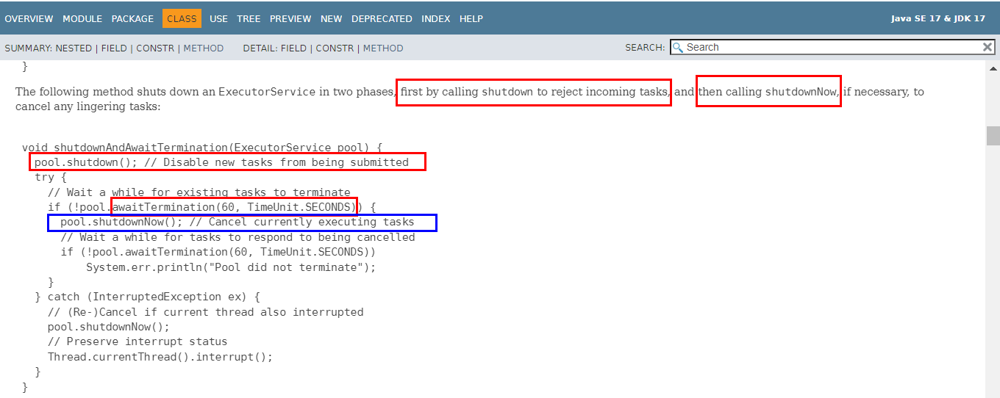

### 线程间的教据传递和父子线程共享

ThreadLocal

InheritableThreadLocal

TransmittableThreadLocal，需要导入pom包

```xml
<!-- 线程传递值 -->
<dependency>
    <groupId>com.alibaba</groupId>
    <artifactId>transmittable-thread-local</artifactId>
    <version>2.14.3</version>
</dependency>
```


```java
package com.atguigu.interview2.juc;

import com.alibaba.ttl.TransmittableThreadLocal;
import com.alibaba.ttl.threadpool.TtlExecutors;
import lombok.extern.slf4j.Slf4j;

import java.util.concurrent.CompletableFuture;
import java.util.concurrent.ExecutorService;
import java.util.concurrent.Executors;
import java.util.concurrent.TimeUnit;

/**ThreadLocal  VS  InheritableThreadLocal VS  TransmittableThreadLocal
 */
@Slf4j
public class ThreadLocalDemoV3
{
    public static void main(String[] args)
    {
        //m1();
        //m2();
        //m3();  //InheritableThreadLocal
        //m4();
        m5();   //TransmittableThreadLocal
    }

    private static void m5()
    {
        TransmittableThreadLocal<String> transmittableThreadLocal = new TransmittableThreadLocal<>();
        //为了看到效果，这里创建大小为1的线程池方便看到效果,池中只有1个线程才有效果，池中只有1个线程才有效果
        ExecutorService threadPool = Executors.newSingleThreadExecutor();
        //这里需要用 TtlExecutors.getTtlExecutorService 将原线程池包装下
        threadPool = TtlExecutors.getTtlExecutorService(threadPool);

        //这里是主线程，使用 transmittableThreadLocal.set 放入值：Java
        transmittableThreadLocal.set(Thread.currentThread().getName()+"-Java");
        log.info("major:{}", transmittableThreadLocal.get());

        //在线程池中通过 transmittableThreadLocal 拿值，看看能否拿到 刚才放入的Java？
        threadPool.execute(() -> {
            log.info("threadPool第1次获取 major:{}", transmittableThreadLocal.get());
        });

        try { TimeUnit.SECONDS.sleep(1); } catch (InterruptedException e) { e.printStackTrace(); }
        System.out.println();
        System.out.println();

        //这里又在主线程中放入了Vue
        transmittableThreadLocal.set(Thread.currentThread().getName()+"-Vue我已经修改了，O(∩_∩)O");
        log.info("major:{}", transmittableThreadLocal.get());

        //这里又在线程池中通过 transmittableThreadLocal.get 方法拿值，看看能否拿到 刚才放入的Vue？
        threadPool.execute(() -> {
            //在线程池中通过 transmittableThreadLocal 拿值，看看能否拿到？
            log.info("threadPool第2次获取 major:{}", transmittableThreadLocal.get());
        });
        System.out.println();

        try { TimeUnit.SECONDS.sleep(1); } catch (InterruptedException e) { e.printStackTrace(); }
        threadPool.shutdown();

        /**
         * 解决线程池中线程因为复用而不能取得外部线程数据的问题
         */
    }

    private static void m4()
    {
        //InheritableThreadLocal：遇到线程池，会有问题

        InheritableThreadLocal<String> inheritableThreadLocal = new InheritableThreadLocal();
        //这里是主线程，使用 InheritableThreadLocal.set 放入值：Java
        inheritableThreadLocal.set(Thread.currentThread().getName()+"-Java");
        log.info("major:{}", inheritableThreadLocal.get());

        //为了看到效果，这里创建大小为1的线程池方便看到效果,池中只有1个线程才有效果，池中只有1个线程才有效果
        ExecutorService threadPool = Executors.newFixedThreadPool(1);
        //在线程池中通过 InheritableThreadLocal 拿值，看看能否拿到 刚才放入的Java？
        threadPool.execute(() -> {
            log.info("threadPool第1次获取 major:{}", inheritableThreadLocal.get());
        });

        try { TimeUnit.SECONDS.sleep(1); } catch (InterruptedException e) { e.printStackTrace(); }
        System.out.println();
        System.out.println();


        //这里又在主线程中放入了Vue
        inheritableThreadLocal.set(Thread.currentThread().getName()+"-Vue我已经修改了，O(∩_∩)O");
        log.info("major:{}", inheritableThreadLocal.get());

        //这里又在线程池中通过 InheritableThreadLocal.get 方法拿值，看看能否拿到 刚才放入的Vue？
        threadPool.execute(() -> {
            //在线程池中通过 inheritableThreadLocal 拿值，看看能否拿到？
            log.info("threadPool第2次获取 major:{}", inheritableThreadLocal.get());
        });

        try { TimeUnit.SECONDS.sleep(1); } catch (InterruptedException e) { e.printStackTrace(); }
        threadPool.shutdown();


        /**
         * new新建可以
         * 复用不好使，没有new
         */
    }

    private static void m3()
    {
        InheritableThreadLocal<String> inheritableThreadLocal = new InheritableThreadLocal();

        //这里是主线程，使用 InheritableThreadLocal.set 放入值：Java
        inheritableThreadLocal.set(Thread.currentThread().getName()+"-Java");
        log.info("major:{}", inheritableThreadLocal.get());

        //新建线程thread1，在子线程thread1中去ThreadLocal中拿main线程放入值，能否拿到？
        //使用InheritableThreadLocal，子线程可以获得父线程set进去的值
        new Thread(() -> {
            log.info("major:{}", inheritableThreadLocal.get());
        }, "thread1").start();

        new Thread(() -> {
            log.info("major:{}", inheritableThreadLocal.get());
        }, "thread2").start();

        new Thread(() -> {
            log.info("major:{}", inheritableThreadLocal.get());
        }, "thread3").start();
    }

    private static void m2()
    {
        ThreadLocal<String> threadLocal = ThreadLocal.withInitial(() -> null);
        //这里是主线程，ThreadLocal中设置了值：Java
        threadLocal.set(Thread.currentThread().getName()+"-Java");
        log.info("major:{}", threadLocal.get());

        //新建线程thread1，在子线程thread1中去ThreadLocal中拿main线程放入值，能否拿到？
        //自己set的才能自己get，别人的取不到,分灶吃饭，自取自划
        new Thread(() -> {
            log.info("major:{}", threadLocal.get());
        }, "thread1").start();
    }

    private static void m1()
    {
        //ThreadLocal可以在当前线程中共享数据，set/get需要在同一个线程中执行才行，别人的取不到
        ThreadLocal<String> threadLocal = ThreadLocal.withInitial(() -> null);

        threadLocal.set(Thread.currentThread().getName()+"-Java");
        log.info("major:{}", threadLocal.get());
        System.out.println();


        //新建线程thread1，设置Vue，然后取出学科名看看?
        new Thread(() -> {
            log.info("major:{}", threadLocal.get());//thread1是否可以取得main线程上一步写入的值？
            threadLocal.set(Thread.currentThread().getName()+"-Vue");
            log.info("major:{}", threadLocal.get());
        }, "thread1").start();
        System.out.println();
        //暂停几秒钟线程
        try { TimeUnit.SECONDS.sleep(1); } catch (InterruptedException e) { e.printStackTrace(); }


        //新建线程thread2，设置Flink，然后取出学科名看看?
        new Thread(() -> {
            log.info("major:{}", threadLocal.get());
            threadLocal.set(Thread.currentThread().getName()+"-Flink");
            log.info("major:{}", threadLocal.get());
        }, "thread2").start();
        System.out.println();

        CompletableFuture.supplyAsync(() -> {
            log.info("major:{}", threadLocal.get());
            threadLocal.set(Thread.currentThread().getName()+"-mysql");
            log.info("major:{}", threadLocal.get());
            return null;
        });
        System.out.println();

        //暂停毫秒
        try { TimeUnit.MILLISECONDS.sleep(500); } catch (InterruptedException e) { e.printStackTrace(); }

        /**
         * Thread里面有ThreadLocal里面有个ThreadLocalMap
         *
         * ThreadLocalMap里面有set方法
         *     private void set(ThreadLocal<?> key, Object value)
         */
    }
}
```

### 线程池如何正确关闭

#### <font color = 'red'>官网示例：优雅关闭线程池</font>

https://docs.oracle.com/en/java/javase/17/docs/api/java.base/java/util/concurrent/ExecutorService.html 


#### 关闭线程池API方法

threadPool.shutdown();

threadPool.shutdownNow();

执行shutdown方法或shutdownNow方法之后，将会影响任务的状态

### shutdown 解析

启动一个有序的关闭过程，在这个过程中，之前已经提交的任务将被执行，但不会接受新的任务。如果系统已经关闭，那么再次调用此方法将不会产生额外的效果

**源码注释：**



即：不会再接受新任务的提交，在 shutdown 调用之前的任务会被执行下去，待执行的任务和正在执行的任务<font color = 'red'>都不会取消，将继续执行</font>,如果已经 shutdown 了，再调用不会有其他影响

```java
/**
 * 第6个任务开始及之后的任务都被拒绝了，1~5号任务正常执行。
 * 所以 shutdown 方法将线程池状态置为 SHUTDOWN，线程池并不会立即停止，
 * 要等正在执行和队列里等待的任务执行完才会停止。
 */
private static void shutdown_Test()
{
    ExecutorService threadPool = Executors.newSingleThreadExecutor();
    //提交10个任务，在第5个任务提交完，准备提交第6个的时候执行shutdown
    for (int i = 1; i <=10; i++)
    {
        System.out.println("第："+i+" 次提交");
        //此处故意不加try...catch块，方便效果演示
        threadPool.execute(new Task(i));
        //i等于5的时候shutdown，意味着从第6次开始就不能提交新任务
        if (i == 5)
        {
            threadPool.shutdown();
        }
    }
}

static class Task implements Runnable
{
    @Getter
    String name = "";

    public Task(int i) {
        name = "task-" + i;
    }

    @Override
    public void run()
    {
        try
        {
            TimeUnit.SECONDS.sleep(2);
            System.out.println("sleep completed, " + getName());
        } catch (InterruptedException e) {
            e.printStackTrace();
            System.out.println("interrupted, " + getName());
            return;
        }
        System.out.println(getName() + " finished");
        System.out.println();
    }
}
```

### shutdownNow 解析

尝试停止所有正在执行的任务，中止等待中任务的处理，并返回等待执行的任务列表。

**源码注释1：**



即：不会再接受新任务的提交；尝试停止所有正在执行的任务；待执行的任务会取消并返回等待任务的列表；该方法返回时，这些等待的任务将从队列中清空

**源码注释2：**

是通过 interrupt 方法去终止正在运行的任务的，因此无法响应 interrupt 中断的任务可能不会被终止(so any task that fails to respond to interrupts may never terminate.)。所以，该方法是无法保证一定能终止任务的，



尝试取消执行中的任务(仅仅是做尝试，成功与否取决于是否响应InteruptedException，以及对其做出的反应)，所以 shutdownNow 方法将线程池状态置为STOP，试图让线程池立刻停止，但不一定能保证立即停止，要等所有正在执行的任务(不能被intermpt 中断的任务)执行完才能停止

### awaitTermination源码注释解读

在关闭请求之后，阻塞直到所有任务都完成执行或者发生超时，或者当前线程被中断，以这三者中先发生的情况为准。


阻塞当前线程，等已提交和已执行的任务都执行完，解除阻塞

当等待超过设置的时间，检查线程池是否停止，如果执行完了返回 true，如果执行完之前超时了，返回 false并解除阻塞


### 关闭线程池姿势

#### 理论

关闭线程池的关键是 shutdown + awaitTermination或者 shutdownNow + awaitTermination


#### 官网：https://docs.oracle.com/en/java/javase/17/docs/api/java.base/java/util/concurrent/ExecutorService.html 



示例代码

```java
/**
 * 参考官网使用，最后的终结，优雅关停，but有点费事
 * @param threadPool
 */
public static void finalOK_shutdownAndAwaitTermination(ExecutorService threadPool)
{
    if (threadPool != null && !threadPool.isShutdown())
    {
        threadPool.shutdown();
        try
        {
            if (!threadPool.awaitTermination(120, TimeUnit.SECONDS))
            {
                threadPool.shutdownNow();

                if (!threadPool.awaitTermination(120, TimeUnit.SECONDS))
                {
                    System.out.println("Pool did not terminate");
                }
            }
        } catch (InterruptedException ie) {
            threadPool.shutdownNow();
            Thread.currentThread().interrupt();
        }
    }
}
```

全部案例：

```java
/**
 * 正确关闭线程池姿势——优雅停机
 */
public class ThreadPoolGracefulShutdownDemo
{
    public static void main(String[] args)
    {
        //shutdown_Test();
        //shutdownNow_Test();
        //shutdown_awaitTermination_Test();
        shutdownNow_awaitTermination_Test();
        ExecutorService threadPool = Executors.newFixedThreadPool(3);

        try
        {

        }catch (Exception e){
            e.printStackTrace();
        }finally {
            finalOK_shutdownAndAwaitTermination(threadPool);
        }
    }

    private static void shutdownNow_awaitTermination_Test()
    {
        ExecutorService threadPool = Executors.newSingleThreadExecutor();

        for (int i = 1; i <=10; i++)
        {
            try {
                threadPool.execute(new Task(i));
            } catch (RejectedExecutionException e) {
                System.out.println("rejected, task-" + i);
            }

            if (i == 5) {
                List<Runnable> tasks = threadPool.shutdownNow();
                for (Runnable task : tasks) {
                    if (task instanceof Task) {
                        System.out.println("waiting task: " + ((Task) task).getName());
                    }
                }
            }
        }

        try {
            boolean isStop = threadPool.awaitTermination(4, TimeUnit.SECONDS);
            System.out.println("is pool isStop: " + isStop);
            System.out.println(Thread.currentThread().getName()+"\t"+"2222222222222222222");
        } catch (InterruptedException e) {
            e.printStackTrace();
        }
        System.out.println("-----------------");
        System.out.println(Thread.currentThread().getName()+"\t"+"all tests finished");
    }

    private static void shutdown_awaitTermination_Test()
    {
        ExecutorService threadPool = Executors.newSingleThreadExecutor();
        //提交10个任务，在第5个任务提交完，准备提交第6个的时候执行shutdown
        for (int i = 1; i <=10; i++)
        {
            System.out.println("第："+i+" 次提交");
            try {
                threadPool.execute(new Task(i));
            } catch (RejectedExecutionException  e) {
                System.out.println("rejected, task-" + i);
            }
            //i等于5的时候shutdown，意味着从第6次开始就不能提交新任务
            if (i == 5)
            {
                threadPool.shutdown();
                System.out.println("i等于5的时候shutdown，意味着从第6次开始就不能提交新任务");
                System.out.println();
            }
        }

        try
        {
            /**
             * 任务没执行完且没到设定时间，是不会执行最下面两行打印代码的。
             *
             * 现在把等待时间设置为4秒，达到设置时间后，就不再阻塞当前线程了，
             * 直接打印了下面两行代码，并且返回了 false 说明线程池没有停止。
             *
             * 有时我们需要主线程等所有子线程执行完毕后再运行，在所有任务提交后，
             * 调用shutdown触发 awaitTermination，阻塞主线程，当所有子线程执行完毕后，解除阻塞。
             */
            boolean isStop = threadPool.awaitTermination(4, TimeUnit.SECONDS);
            System.out.println("is pool isStop: " + isStop);
            System.out.println(Thread.currentThread().getName()+"\t"+"111111111111111111111111");
        } catch (InterruptedException e) {
            e.printStackTrace();
        }
        System.out.println("-----------------");
        System.out.println(Thread.currentThread().getName()+"\t"+"mission is over");
        System.out.println();
    }

    /**
     * 调用 shutdownNow 后，第一个任务正在睡眠的时候，触发了 interrupt 中断，
     * 之前等待的任务2-5被从队列中清除并返回，之后的任务6~10被拒绝
     * but
     * shutdownNow 方法将线程池状态置为 STOP，试图让线程池立刻停止，
     * 但不一定能保证立即停止，要等所有正在执行的任务（不能被 interrupt 中断的任务）执行完才能停止
     */
    private static void shutdownNow_Test()
    {
        //一池一个线程
        ExecutorService threadPool = Executors.newSingleThreadExecutor();

        for (int i = 1; i <=10; i++)
        {
            try
            {
                threadPool.execute(new Task(i));
            } catch (RejectedExecutionException e) {
                System.out.println("rejected, task-" + i);
            }

            if (i == 5)
            {
                List<Runnable> tasks = threadPool.shutdownNow();
                for (Runnable task : tasks) {
                    if (task instanceof Task) {
                        System.out.println("waiting task: " + ((Task) task).getName());
                    }
                }
            }
        }
    }

    /**
     * 第6个任务开始及之后的任务都被拒绝了，1~5号任务正常执行。
     * 所以 shutdown 方法将线程池状态置为 SHUTDOWN，线程池并不会立即停止，
     * 要等正在执行和队列里等待的任务执行完才会停止。
     */
    private static void shutdown_Test()
    {
        ExecutorService threadPool = Executors.newSingleThreadExecutor();
        //提交10个任务，在第5个任务提交完，准备提交第6个的时候执行shutdown
        for (int i = 1; i <=10; i++)
        {
            System.out.println("第："+i+" 次提交");
            //此处故意不加try...catch块，方便效果演示
            threadPool.execute(new Task(i));
            //i等于5的时候shutdown，意味着从第6次开始就不能提交新任务
            if (i == 5)
            {
                threadPool.shutdown();
            }
        }
    }

    /**
     * 线程执行的任务
     */
    static class Task implements Runnable
    {
        @Getter
        String name = "";

        public Task(int i)
        {
            name = "task-" + i;
        }

        @Override
        public void run()
        {
            try
            {
                TimeUnit.SECONDS.sleep(2);
                System.out.println("sleep completed, " + getName());
            } catch (InterruptedException e) {
                e.printStackTrace();
                System.out.println("interrupted, " + getName());
                return;
            }
            System.out.println(getName() + " finished");
            System.out.println();
        }
    }

    /**
     * 参考官网使用，最后的终结，优雅关停，but有点费事
     * @param threadPool
     */
    public static void finalOK_shutdownAndAwaitTermination(ExecutorService threadPool)
    {
        if (threadPool != null && !threadPool.isShutdown())
        {
            threadPool.shutdown();
            try
            {
                if (!threadPool.awaitTermination(120, TimeUnit.SECONDS))
                {
                    threadPool.shutdownNow();

                    if (!threadPool.awaitTermination(120, TimeUnit.SECONDS))
                    {
                        System.out.println("Pool did not terminate");
                    }
                }
            } catch (InterruptedException ie) {
                threadPool.shutdownNow();
                Thread.currentThread().interrupt();
            }
        }
    }
}
```


