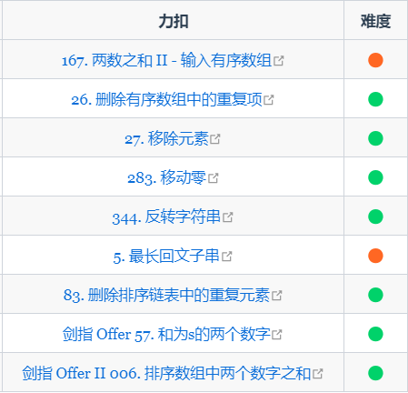
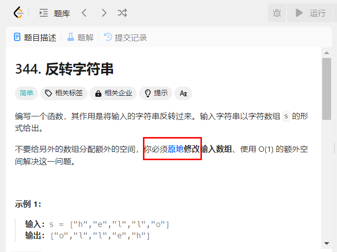
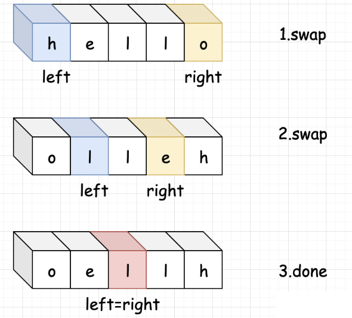
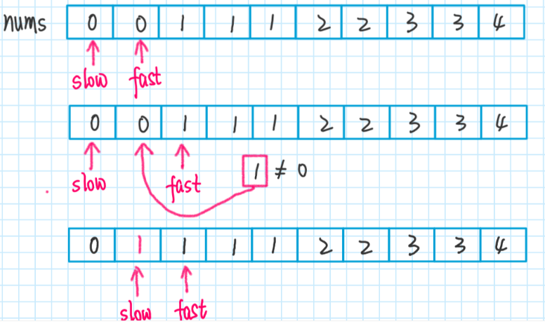
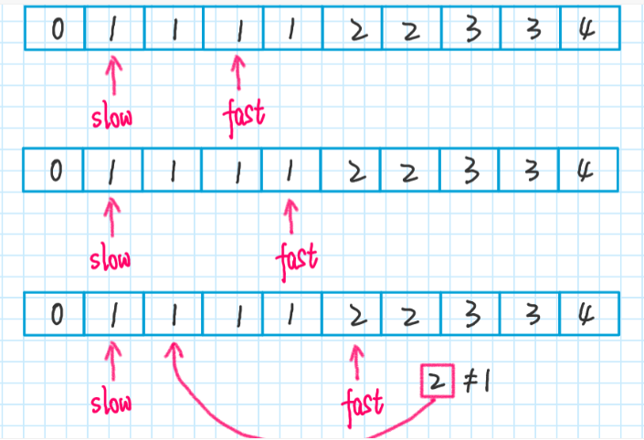
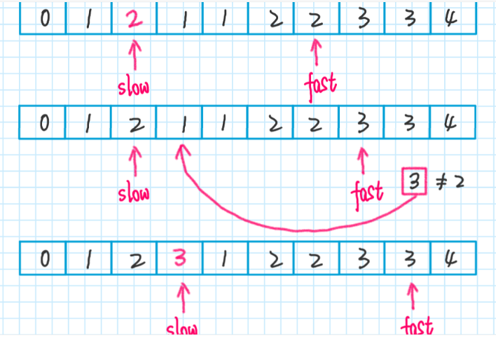

### leetcode第一题，求两数之和

####  暴力

```java
public class LeetCode001
{
    public int[] twoSum(int[] nums, int target)
    {
        for (int i = 0; i < nums.length; i++) {
            for (int j = i+1; j < nums.length ; j++) {
                if(target == nums[i] + nums[j])
                {
                    return new int[]{i,j};
                }
            }
        }
        return null;
    }
}
```

#### 最优

```java
public class LeetCode001
{
    public int[] twoSum(int[] nums, int target)
    {
        Map<Integer,Integer> map = new HashMap<>(nums.length);

        for (int i = 0; i < nums.length; i++)
        {
            int partnerNumber = target - nums[i];

            if(map.containsKey(partnerNumber))
            {
                return new int[]{map.get(partnerNumber),i};
            }
            /**
             * map   K   V
             * 1轮   2   0
             * 2轮   7   1
             * 3轮   11  2
             * 4轮   ......
             */
            map.put(nums[i],i);
        }
        return null;
    }
}
```

### 算法该如何刷?按照序号走?


### 双指针举例

#### 母题说明



#### <font color = 'red'>双指针技巧</font>

<font color = 'red'>只要数组有序，就应该想到双指针技巧</font>

双指针技巧主要分为两类：左右指针和快慢指针

- 左右指针-left/right

  可能相向，可能相背，多用于数组

- 前后指针- slow/fast

  人在前面跑，魂在后面追，两个指针同向而行，一快一慢，慢，多用于链表

### 结论小口诀

#### 小口诀1：左右指针

//结果比目标，小了要变大，左针右移+

//结果比目标，大了要变小，右针左移-

#### 小口诀2：前后指针

快慢相等值不变,慢针不动快针走；

快慢不等值，我是题型1，慢针向前一步走，快针赋值给慢针，快针向前一步走;

快慢不等值，我是题型2，快针慢针值互换，慢针向前一步走，快针向前一步走;

### Leetcode指针问题

#### 左右指针

344.反转字符串



#### 图解说明



```java
public class LeetCode344
{
    public void reverseString(char[] s)
    {
        int left=0,right = s.length - 1;
        while(left < right)
        {
            //1 先交换
            char temp = s[left];
            s[left] = s[right];
            s[right] = temp;
            //2 再加减
            left++;
            right--;
        }
    }
}
```

167.两数之和：https://leetcode.cn/problems/two-sum-ii-input-array-is-sorted/description/

```java
/**
 *
 * 167. 两数之和 II - 输入有序数组
 * https://leetcode.cn/problems/two-sum-ii-input-array-is-sorted/
 */
public class LeetCode167
{
    public int[] twoSum(int[] numbers, int target)
    {
        // 一左一右两个指针相向而行
        int left = 0,right = numbers.length - 1;
        while(left < right)
        {
            int sum = numbers[left] + numbers[right];
            if(sum == target)
            {
                // 题目要求:给你一个下标从 1 开始的整数数组 numbers...所以两个下标指针都加个1
                return new int[]{left + 1 ,right + 1};
            }else if(sum < target){
                left++; //让sum大一点，左指针向右变大
            }else if(sum > target){
                right--;    //让sum小一点，右指针向左变小
            }
        }
        return new int[]{-1,-1};
    }
}
```

### 前后指针

#### 26.删除有序数组中的重复项

https://leetcode.cn/problems/remove-duplicates-from-sorted-array/description/

#### 前后指针图解

<font color = 'red'>快慢不等值，我是题型1，慢针向前一步走，快针赋值给慢针，快针向前一步走;</font>









```java
/**
 * 26. 删除有序数组中的重复项
 * https://leetcode.cn/problems/remove-duplicates-from-sorted-array/description/
 *
 * 快慢相等值不变，慢针不动快针走；
 * 快慢不等值情况1，慢针向前一步走，快针赋值给慢针，快针向前一步走；
 */
public class LeetCode026
{
    /**
     输入：nums = [0,0,1,1,1,2,2,3,3,4]
     输出：5, nums = [0,1,2,3,4]
     解释：函数应该返回新的长度 5 ， 并且原数组 nums 的前五个元素被修改为 0, 1, 2, 3, 4 。
     不需要考虑数组中超出新长度后面的元素。
     * */

    public int removeDuplicates(int[] nums) {
        int fast = 0,slow = 0;
        while(fast < nums.length)
        {
            if(nums[fast] != nums[slow])
            {
                slow++;
                //可以保证nums[0..slow] 无重复
                nums[slow] = nums[fast];
            }
            fast++;
        }
        // 数组长度为索引 + 1
        return slow + 1;
    }
}
```


