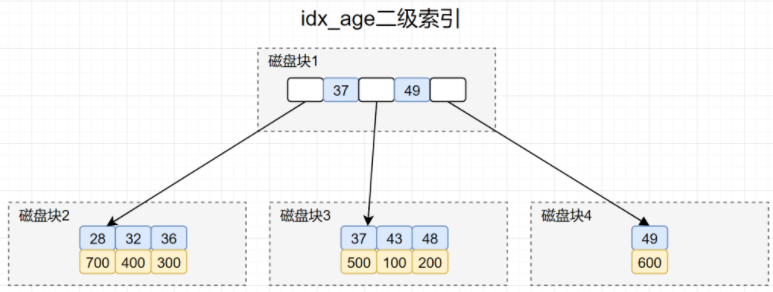
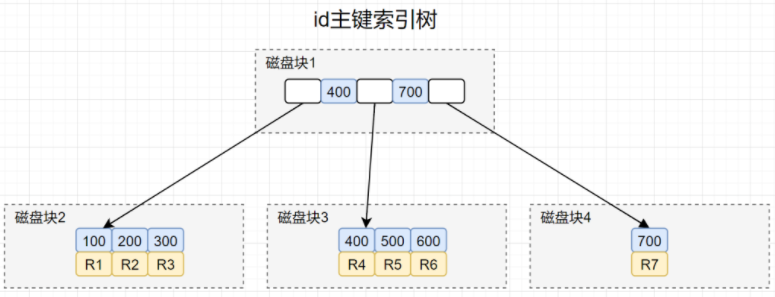
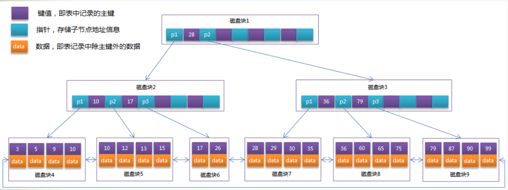

### 通过辅助索引(二级索引)拿到主键后再回到主键索引查询的过程，就叫做「回表」

少用，最好不用；**回表是指数据库根据素引(非主键)找到了指定的记录所在行后，还需要根据主键再次到数据块里获取数据的操作**。

### 建表SQL

```sql
CREATE TABLE `employee` (
  `id` INT(11) NOT NULL,
  `name` VARCHAR(255) DEFAULT NULL,
  `age` INT(11) DEFAULT NULL,
  `date` DATETIME DEFAULT NULL,
  `sex` INT(1) DEFAULT NULL,
  PRIMARY KEY (`id`),
  KEY `idx_age` (`age`) USING BTREE
) ENGINE=INNODB DEFAULT CHARSET=utf8;

INSERT INTO employee VALUES(100,'小伦',43,'2021-01-20','0');
INSERT INTO employee VALUES(200,'俊杰',48,'2021-01-21','0');
INSERT INTO employee VALUES(300,'紫琪',36,'2020-01-21','1');
INSERT INTO employee VALUES(400,'立红',32,'2020-01-21','0');
INSERT INTO employee VALUES(500,'易迅',37,'2020-01-21','1');
INSERT INTO employee VALUES(600,'小军',49,'2021-01-21','0');
INSERT INTO employee VALUES(700,'小燕',28,'2021-01-21','1');

EXPLAIN SELECT * FROM employee WHERE age = 32;
```

### 如果SELECT * FROM employee WHERE age= 32查询SQL,需要执行几次树搜索操作?

#### explain分析


#### 回表分析

##### 1.age索引



1 搜索idx_age索引树，将磁盘块1加载到内存，由于32<37,搜索左路分支，加载到磁盘寻址磁盘块2。

2 将磁盘块2加载到内存中，在内存继续遍历，找到age=32的记录，取得id = 400，拿到id=400后，回到id主键索引树。

##### 2.主键索引



3 搜索id主键索引树，将磁盘块1加载内存，在内存遍历找到了400，但是B+树索引非叶子节点是不保存数据的。

索引会继续搜索400的右分支，到磁盘寻址磁盘块3.

4 将磁盘块3加载内存再内存遍历，找到id=400的记录，拿到第4行(Row4)这一行的数据，查询成功。

##### 过程分析

1 搜索idx_age索引树，将磁盘块1加载到内存，由于32<37,搜索左路分支，加载到磁盘寻址磁盘块2。

2 将磁盘块2加载到内存中，在内存继续遍历，找到age=32的记录，取得id = 400，拿到id=400后，回到id主键索引树。

3 搜索id主键索引树，将磁盘块1加载内存，在内存遍历找到了400，但是B+树索引非叶子节点是不保存数据的。

索引会继续搜索400的右分支，到磁盘寻址磁盘块3.

4 将磁盘块3加载内存再内存遍历，找到id=400的记录，拿到第4行(Row4)这一行的数据，查询成功。

##### 结论

在idx_age二级索引树找到主键id后，回到id主键索引搜索的过程,就称为回表

### B+树检索原理

**由于B+树的非叶子节点只存储键值信息，假设每个磁盘块能存储4个键值及指针信息，则变成B+树后其结构如下图所示：** 



**B+树中**，所有数据记录节点都是按照键值大小顺序存放在同一层的叶子节点上，而非叶子节点上只存储key值信息，这样可以大大加大每个节点存储的key值数量，降低B+树的高度。

**<font color = 'red'>B+树算法</font>**： 通过继承了B树的特征，B+树相比B树，新增叶子节点与非叶子节点关系。

叶子节点中包含了键值和数据，

根节点和枝节点中，只是包含键值和子节点引用，<font color = 'red'>不包含数据。</font>

通过非叶子节点查询叶子节点获取对应的数据，所有相邻的叶子节点包含非叶子节点使用链表进行结合，叶子节点是顺序排序并且相邻节点有顺序引用的关系


