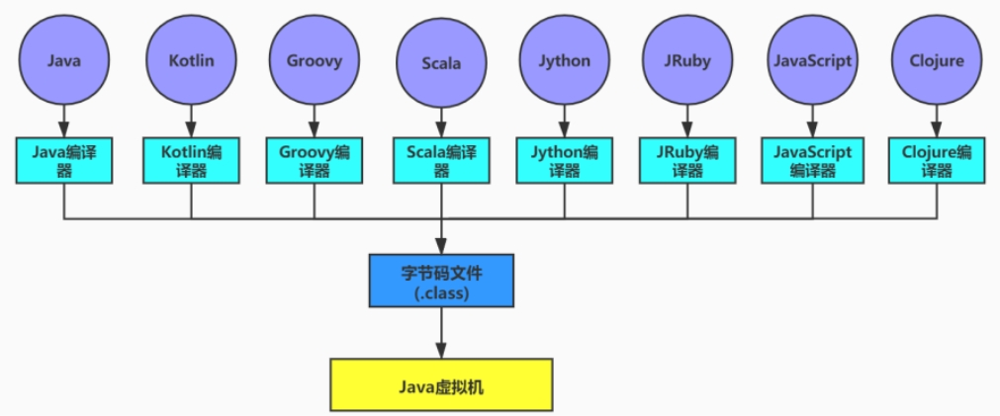

## 字节码文件是跨平台的吗？

 Java 虚拟机不和包括 Java 在内的任何语言绑定，它只与“Class 文件”这种特定的二进制文件格式所关联。
无论使用何种语言进行软件开发，只要能将源文件编译为正确的Class文件，那么这种语言就可以在Java虚拟机上执行。可以说，统一而强大的Class文件结构，就是Java虚拟机的基石、桥梁。

想要让一个Java程序正确地运行在JVM中，Java源码就必须要被编译为符合JVM规范的字节码。

https://docs.oracle.com/javase/specs/index.html

- 所有的JVM全部遵守Java虚拟机规范，也就是说所有的JVM环境都是一样的，这样一来字节码文件可以在各种JVM上运行。

从Java虚拟机的角度看，通过Class文件，可以让更多的计算机语言支持Java虚拟机平台。因此，Class文件结构不仅仅是Java虚拟机的执行入口，更是Java生态圈的基础和核心。

### class文件里是什么？

字节码文件里是什么？
源代码经过编译器编译之后便会生成一个字节码文件，字节码是一种二进制的类文件，它的内容是JVM的指令，而不像C、C++经由编译器直接生成机器码。

随着Java平台的不断发展，在将来，Class文件的内容也一定会做进一步的扩充，但是其基本的格式和结构不会做重大调整。