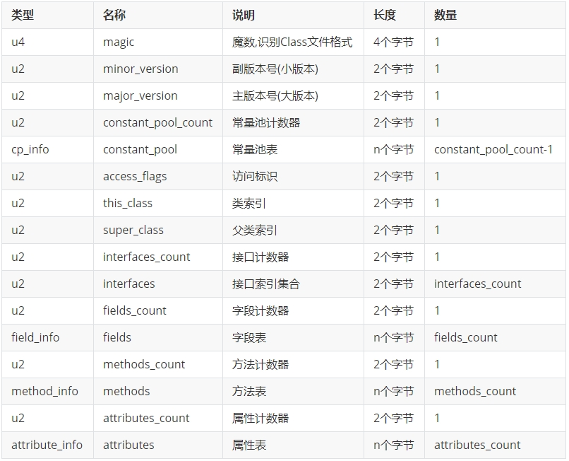

## class文件结构细节概述

- class文件结构概述

  Class文件的结构并不是一成不变的，随着Java虚拟机的不断发展，总是不可避免地会对Class文件结构做出一些调整，但是其基本结构和框架是非常稳定的。

Class文件的总体结构如下：

- 魔数
- Class文件版本
- 常量池
- 访问标识(或标志)
- 类索引，父类索引，接口索引集合
- 字段表集合
- 方法表集合
- 属性表集合

这是一张Java字节码总的结构表，我们按照上面的顺序逐一进行解读就可以了。

## class文件的魔数是什么

**Magic Number（魔数）：class文件的标志**

- 每个 Class 文件开头的4个字节的无符号整数称为魔数（Magic Number）
- 它的唯一作用是确定这个文件是否为一个能被虚拟机接受的有效合法的Class文件。即：魔数是Class文件的标识符。
- 魔数值固定为0xCAFEBABE。不会改变。
- 如果一个Class文件不以0xCAFEBABE开头，虚拟机在进行文件校验的时候就会直接抛出以下错误：
  Error: A JNI error has occurred, please check your installation and try again
  Exception in thread "main" java.lang.ClassFormatError: Incompatible magic value 1885430635 in class file StringTest
- 使用魔数而不是扩展名来进行识别主要是基于安全方面的考虑，因为文件扩展名可以随意地改动。

## 如何确保高版本的JVM可执行低版本的class文件

- 不同版本的Java编译器编译的Class文件对应的版本是不一样的。目前，高版本的Java虚拟机可以执行由低版本编译器生成的Class文件,但是低版本的Java虚拟机不能执行由高版本编译器生成的Class文件。否则JVM会抛出java.lang.UnsupportedClassVersionError异常。 （向下兼容）
- 在实际应用中，由于开发环境和生产环境的不同，可能会导致该问题的发生。因此，需要我们在开发时，特别注意开发编译的JDK版本和生产环境中的JDK版本是否一致。

**class文件版本号**

- 紧接着魔数的 4 个字节存储的是 Class 文件的版本号。同样也是4个字节。第5个和第6个字节所代表的含义就是编译的副版本号minor_version，而第7个和第8个字节就是编译的主版本号major_version。
- 它们共同构成了class文件的格式版本号。譬如某个 Class 文件的主版本号为 M，副版本号为 m，那么这个Class 文件的格式版本号就确定为 M.m。
- 版本号和Java编译器的对应关系如下表：
  

- Java 的版本号是从45开始的，JDK 1.1之后的每个JDK大版本发布主版本号向上加1。
- 虚拟机JDK版本为1.k （k >= 2）时，对应的class文件格式版本号的范围为45.0 - 44+k.0 （含两端）。

 ## 常量池

### 常量池的作用

常量池：存放所有常量

- 常量池是Class文件中内容最为丰富的区域之一。常量池对于Class文件中的字段和方法解析也有着至关重要的作用。
- 常量池：可以理解为Class文件之中的资源仓库，它是Class文件结构中与其他项目关联最多的数据类型（后面的很多数据类型都会指向此处），也是占用Class文件空间最大的数据项目之一。
- 常量池表项中，用于存放编译时期生成的各种字面量和符号引用，这部分内容将在类加载后进入方法区的运行时常量池中存放。
- 在版本号之后，紧跟着的是常量池的数量，以及若干个常量池表项。
- 常量池中常量的数量是不固定的，所以在常量池的入口需要放置一项u2类型的无符号数，代表常量池容量计数值（constant_pool_count）。与Java中语言习惯不一样的是，这个容量计数是从1而不是0开始的。

由上表可见，Class文件使用了一个前置的容量计数器（constant_pool_count）加若干个连续的数据项（constant_pool）的形式来描述常量池内容。我们把这一系列连续常量池数据称为常量池集合。

 

