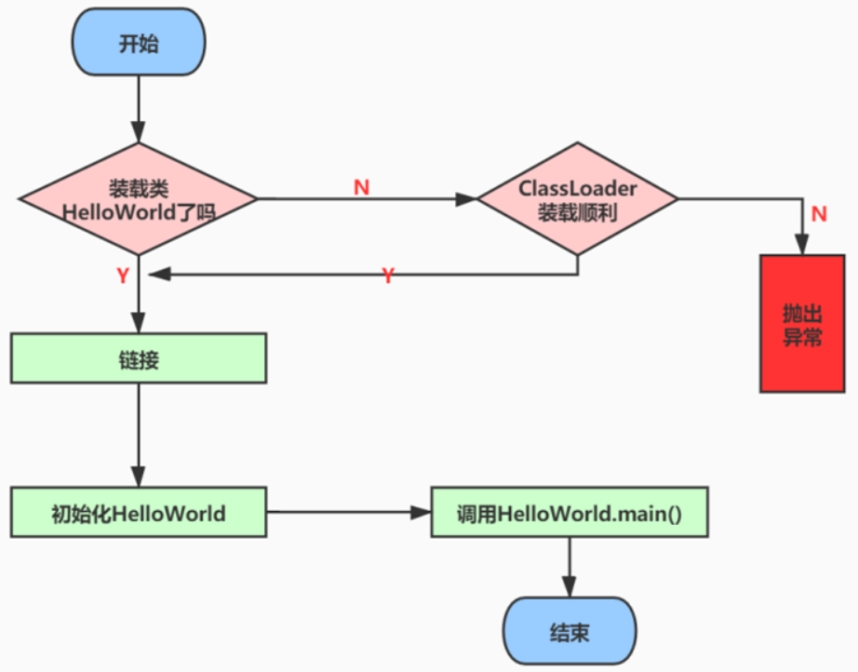
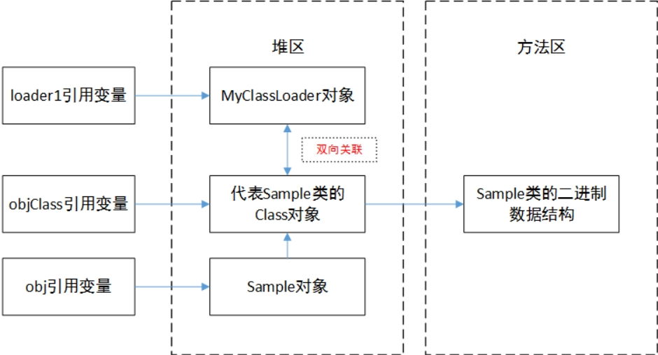

## 类加载分几步？

 按照Java虚拟机规范，从class文件到加载到内存中的类，到类卸载出内存为止，它的整个生命周期包括如下7个阶段：


其中：

①第一过程的加载(loading)也称为装载

②验证、准备、解析 3 个部分统称为链接（Linking）

从程序中类的使用过程看：



 ### 都谁需要加载？

在Java中数据类型分为基本数据类型和引用数据类型。**基本数据类型由虚拟机预先定义，引用数据类型则需要进行类的加载。**

### 面试题

- Java 类加载过程?（苏宁）
- 描述一下 JVM 加载 Class 文件的原理机制?（国美）
- JVM底层怎么加载class文件的？（蚂蚁金服）
- 类加载过程 （蚂蚁金服）
- Java 类加载过程? （百度）
- 描述一下 JVM 加载 Class 文件的原理机制? （蚂蚁金服）
- Java类加载过程  （美团）
- 描述一下JVM加载class文件的原理机制  （美团）
- 什么是类的加载？ （京东）
- 讲一下JVM加载一个类的过程 （京东）

## 过程一：Loading(装载)阶段

### 过程一都做了什么事？

过程一：类的装载
<font color = 'red'>所谓装载，简而言之就是将Java类的字节码文件加载到机器内存中，并在内存中构建出Java类的原型——类模板对象。</font>

装载完成的操作

<font color = 'red'>装载阶段，简言之，查找并加载类的二进制数据，生成Class的实例。</font>

在加载类时，Java虚拟机必须完成以下3件事情：

- 通过类的全名，获取类的二进制数据流。
- 解析类的二进制数据流为方法区内的数据结构（Java类模型）
- 创建java.lang.Class类的实例，表示该类型。作为方法区这个类的各种数据的访问入口

### 过程一中什么是类模板对象

**类模板对象**

所谓类模板对象，其实就是Java类在JVM内存中的一个快照，JVM将从字节码文件中解析出的常量池、类字段、类方法等信息存储到类模板中，这样JVM在运行期便能通过类模板而获取Java类中的任意信息，能够对Java类的成员变量进行遍历，也能进行Java方法的调用。

反射的机制即基于这一基础。如果JVM没有将Java类的声明信息存储起来，则JVM在运行期也无法反射。

**类模型的位置**

加载的类在JVM中创建相应的类结构，类结构会存储在方法区(JDK1.8之前：永久代；JDK1.8及之后：元空间)。

### Class实例的位置在哪

**Class实例的位置** 

类将.class文件加载至元空间后，会在堆中创建一个Java.lang.Class对象，用来封装类位于方法区内的数据结构，该Class对象是在加载类的过程中创建的，每个类都对应有一个Class类型的对象。(instanceKlass --> mirror :Class的实例)

图示


外部可以通过访问代表Order类的Class对象来获取Order的类数据结构。

**再说明**

Class类的构造方法是私有的，只有JVM能够创建。

 java.lang.Class实例是访问类型元数据的接口，也是实现反射的关键数据、入口。通过Class类提供的接口，可以获得目标类所关联的.class文件中具体的数据结构：方法、字段等信息。 

 ## 过程二：Linking(链接)阶段

### 环节1：链接阶段之Verification(验证)

当类加载到系统后，就开始链接操作，验证是链接操作的第一步。

<font color = 'red'>它的目的是保证加载的字节码是合法、合理并符合规范的。</font>

验证的步骤比较复杂，实际要验证的项目也很繁多，大体上Java虚拟机需要做以下检査，如图所示。

.jpeg)

**整体说明：**

验证的内容则涵盖了类数据信息的格式验证、语义检查、字节码验证，以及符号引用验证等。

- 其<font color = 'red'>中格式验证会和装载阶段一起执行。</font>验证通过之后，类加载器才会成功将类的二进制数据信息加载到方法区中。
- <font color = 'red'>格式验证之外的验证操作将会在方法区中进行。</font>

具体说明：
1. 格式验证：是否以魔数 OxCAFEBABE开头，主版本和副版本号是否在当前Java虚拟机的支持范围内，数据中每一个项是否都拥有正确的长度等。

2. Java虚拟机会进行字节码的语义检查，但凡在语义上不符合规范的，虚拟机也不会给予验证通过。比如：

  - 是否所有的类都有父类的存在(在Java里，除了Object外，其他类都应该有父类)
  - 是否一些被定义为final的方法或者类被重写或继承了
  - 非抽象类是否实现了所有抽象方法或者接口方法
  - 是否存在不兼容的方法(比如方法的签名除了返回值不同，其他都一样，这种方法会让虚拟机无从下手调度；abstract情况下的方法，就不能是final的了)

3. Java虚拟机还会进行字节码验证，字节码验证也是验证过程中最为复杂的一个过程。它试图通过对字节码流的分析，判断字节码是否可以被正确地执行。比如：

  - 在字节码的执行过程中，是否会跳转到一条不存在的指令
  - 函数的调用是否传递了正确类型的参数
  - 变量的赋值是不是给了正确的数据类型等

  栈映射帧(StackMapTable)就是在这个阶段，用于检测在特定的字节码处，其局部变量表和操作数栈是否有着正确的数据类型。但遗憾的是，100%准确地判断一段字节码是否可以被安全执行是无法实现的，因此，该过程只是尽可能地检査出可以预知的明显的问题。<font color = 'red'>如果在这个阶段无法通过检查，虚拟机也不会正确装载这个类。但是，如果通过了这个阶段的检查，也不能说明这个类是完全没有问题的。</font>

  在前面3次检查中，已经排除了文件格式错误、语义错误以及字节码的不正确性。但是依然不能确保类是没有问题的。

4. 校验器还将进行符号引用的验证。Class文件在其常量池会通过字符串记录自己将要使用的其他类或者方法。因此，在验证阶段，虚拟机就会检查这些类或者方法确实是存在的，并且当前类有权限访问这些数据，如果一个需要使用类无法在系统中找到，则会抛出NoClassDefFoundError,如果一个方法无法被找到，则会抛出NoSuchMethodError。

  <font color = 'red'>此阶段在解析环节才会执行。</font>

### 环节2：链接阶段之Preparation(准备)

<font color = 'red'>简言之，为类的静态变量分配内存，并将其初始化为</font><font color = 'orange'>默认值。</font>

在这个阶段，虚拟机就会为这个类分配相应的内存空间，并设置默认初始值。Java虚拟机为各类型变量默认的初始值如表所示。


注意：Java并不支持boolean类型，对于boolean类型，内部实现是int，由于int的默认值是0，故对应的，boolean的默认值就是false。

注意：
1. <font color = 'red'>这里不包含基本数据类型的字段用static final修饰的情况，因为final在编译的时候就会分配了，准备阶段会显式赋值。</font>
2. 注意这里不会为实例变量分配初始化，实例变量是会随着对象一起分配到Java堆中。
3. <font color = 'red'>在这个阶段并不会像初始化阶段中那样会有初始化或者代码被执行。</font>

### 环节3：链接阶段之Resolution(解析)

<font color = 'red'>简言之，将类、接口、字段和方法的符号引用转为直接引用。</font>

所谓解析就是将符号引用转为直接引用，也就是得到类、字段、方法在内存中的指针或者偏移量。因此，可以说，如果直接引用存在，那么可以肯定系统中存在该类、方法或者字段。但只存在符号引用，不能确定系统中一定存在该结构。

 ## 过程三：Initialization(初始化)阶段

### 子类加载前先加载父类？

在加载一个类之前，虚拟机总是会试图加载该类的父类，因此父类的<clinit>总是在子类<clinit>之前被调用。也就是说，父类的static块优先级高于子类。 

口诀：由父及子，静态先行。

### 哪些类不会生成<clinit>方法？

Java编译器并不会为所有的类都产生<clinit>()初始化方法。哪些类在编译为字节码后，字节码文件中将不会包含<clinit>()方法？

- 一个类中并没有声明任何的类变量，也没有静态代码块时
- 一个类中声明类变量，但是没有明确使用类变量的初始化语句以及静态代码块来执行初始化操作时
- 一个类中包含static final修饰的基本数据类型的字段，这些类字段初始化语句采用编译时常量表达式

```java
/**
 * 哪些场景下，java编译器就不会生成<clinit>()方法
 */
public class InitializationTest1 {
    //场景1：对于非静态的字段，不管是否进行了显式赋值，都不会生成<clinit>()方法
    public int num = 1;
    //场景2：静态的字段，没有显式的赋值，不会生成<clinit>()方法
    public static int num1;
    //场景3：比如对于声明为static final的基本数据类型的字段，不管是否进行了显式赋值，都不会生成<clinit>()方法
    public static final int num2 = 1;
}
```

### 代码举例：static与final的搭配问题

```java
/**
 * 测试静态字段的显式赋值哪些是解析阶段，哪些是初始化阶段赋值的。
 */
public class InitilizationTest1 {
    // 在初始化阶段赋值
    public static int a = 1;
    // 在链接阶段的准备环节赋值
    public static final int INT_CONSTANT = 10;

    // 在初始化阶段赋值
    public static final Integer INTEGER_CONSTANT1 = Integer.valueOf(100);
    // 在初始化阶段赋值
    public static Integer INTEGER_CONSTANT2 = Integer.valueOf(1000);
    
    // 在链接阶段的准备环境赋值
    public static final String s0 = "helloworld";
    // 在初始化阶段赋值
    public static final String s1 = new String("helloworld");
}

```

#### 重要结论：

普通基本数据类型和引用类型（即使是常量）的静态变量，是需要额外调用putstatic等JVM指令的，这些是在显式初始化阶段执行，而不是准备阶段调用；而**基本数据类型<font color = 'red'>常量</font>**(非调用方法的显式赋值)、**String类型字面量的定义方式的<font color = 'red'>常量</font>**，则不需要这样的步骤，是在准备阶段完成的。

### <clinit>()的调用会死锁吗？

对于<clinit>()方法的调用，也就是类的初始化，虚拟机会在内部确保其多线程环境中的安全性。

虚拟机会保证一个类的<clinit>()方法在多线程环境中被正确地加锁、同步，如果多个线程同时去初始化一个类，那么只会有一个线程去执行这个类的<clinit>()方法，其他线程都需要阻塞等待，直到活动线程执行<clinit>()方法完毕。

正是因为函数<clinit>()带锁线程安全的，因此，如果在一个类的<clinit>()方法中有耗时很长的操作，就可能造成多个线程阻塞，引发死锁。并且这种死锁是很难发现的，因为看起来它们并没有可用的锁信息。

如果之前的线程成功加载了类，则等在队列中的线程就没有机会再执行<clinit>()方法了。那么，当需要使用这个类时，虚拟机会直接返回给它已经准备好的信息。

### 类的初始化情况：主动使用vs被动使用

#### 主动使用的情况

Java程序对类的使用分为两种：主动使用 和 被动使用。

**主动使用的说明：**

<font color = 'red'>Class只有在必须要首次使用的时候才会被装载，Java虚拟机不会无条件地装载Class类型。Java虚拟机规定，一个类或接口在初次使用前，必须要进行初始化。这里指的“使用”，是指主动使用。</font>
主动使用只有下列几种情况：（即：如果出现如下的情况，则会对类进行初始化操作。而初始化操作之前的加载、验证、准备已经完成。）

1. 当创建一个类的实例时，比如使用new关键字，或者通过反射、克隆、反序列化。
2. 当调用类的静态方法时，即当使用了字节码invokestatic指令。
3. 当使用类、接口的静态字段时(final修饰特殊考虑)，比如，使用getstatic或者putstatic 指令。
4. 当使用java.lang.reflect包中的方法反射类的方法时。比如：Class.forName("com.atguigu.java.Test")
5. 当初始化子类时，如果发现其父类还没有进行过初始化，则需要先触发其父类的初始化。
6. 如果一个接口定义了default方法，那么直接实现或者间接实现该接口的类的初始化，该接口要在其之前被初始化。
7. 当虚拟机启动时，用户需要指定一个要执行的主类（包含main()方法的那个类），虚拟机会先初始化这个主类。
8. 当初次调用 MethodHandle 实例时，初始化该 MethodHandle 指向的方法所在的类。（涉及解析REF_getStatic、REF_putStatic、REF_invokeStatic方法句柄对应的类）


针对5，补充说明：
当Java虚拟机初始化一个类时，要求它的所有父类都已经被初始化，但是这条规则并不适用于接口。
>在初始化一个类时，并不会先初始化它所实现的接口
>在初始化一个接口时，并不会先初始化它的父接口
>因此，一个父接口并不会因为它的子接口或者实现类的初始化而初始化。只有当程序首次使用特定接口的静态字段时，才会导致该接口的初始化。

针对7，说明：

JVM启动的时候通过引导类加载器加载一个初始类。这个类在调用public static void main(String[])方法之前被链接和初始化。这个方法的执行将依次导致所需的类的加载，链接和初始化。

#### 被动使用的情况

被动使用的情况
除了以上的情况属于主动使用，其他的情况均属于被动使用。被动使用不会引起类的初始化。

也就是说：并不是在代码中出现的类，就一定会被加载或者初始化。如果不符合主动使用的条件，类就不会初始化。

1. 当访问一个静态字段时，只有真正声明这个字段的类才会被初始化。
当通过子类引用父类的静态变量，不会导致子类初始化
2. 通过数组定义类引用，不会触发此类的初始化
3. 引用常量不会触发此类或接口的初始化。因为常量在链接阶段就已经被显式赋值了。
4. 调用ClassLoader类的loadClass()方法加载一个类，并不是对类的主动使用，不会导致类的初始化。

> 被动的使用，意味着不需要执行初始化环节，意味着没有<clinit>()的调用。

 #### -XX:+TraceClassLoading

如果针对代码，设置参数-XX:+TraceClassLoading，可以追踪类的加载信息并打印出来。

#### 面试题

 类加载的时机 （百度）

Class的forName("Java.lang.String")和Class的getClassLoader()的loadClass("Java.lang.String")有什么区别？  （百度）

哪些情况会触发类的加载？ （京东）

类的加载 = 装载+链接（①②③）+初始化

 #### 面试题1

```java
class Root{
 static{
   System.out.println("Root的静态初始化块");
 }
 {
   System.out.println("Root的普通初始化块");
 }
 public Root(){
   System.out.println("Root的无参数的构造器");
 }
}

class Mid extends Root{
 static{
   System.out.println("Mid的静态初始化块");
 }
 {
   System.out.println("Mid的普通初始化块");
 }
 public Mid(){
   System.out.println("Mid的无参数的构造器");
 }
 public Mid(String msg){
   //通过this调用同一类中重载的构造器
   this();
   System.out.println("Mid的带参数构造器，其参数值：" + msg);
 }
}

class Leaf extends Mid{
 static{
   System.out.println("Leaf的静态初始化块");
 }
 {
   System.out.println("Leaf的普通初始化块");
 }
 public Leaf(){
   //通过super调用父类中有一个字符串参数的构造器
   super("JVM");
   System.out.println("Leaf的构造器");
 }
}

public class LeafTest{
 public static void main(String[] args){
   new Leaf(); 
   System.out.println();
   new Leaf();
 }
}
```


```java
public class T {
    public static int k = 0;
    public static T t1 = new T("t1");
    public static T t2 = new T("t2");
    public static int i = print("i");
    public static int n = 99;

    public int j = print("j");

    {
        print("构造块");
    }

    static {
        print("静态块");
    }

    public T(String str) {
        System.out.println((++k) + ":" + str + "  i=" + i + "  n=" + n);
        ++n;
        ++i;
    }

    public static int print(String str) {
        System.out.println((++k) + ":" + str + "  i=" + i + "  n=" + n);
        ++n;
        return ++i;
    }

    public static void main(String[] args) {

    }
}
// 上面正确答案：
// 1:j i=8 n=0
// 2:构造块 i=1 n=1
// 3:t1 i=2 n=2
// 4:j i=33n=3
// 5:构造块 i=4 n=4
// 6:t2 i=5 n=5
// 7:i i=6 n=6
// 8:静态块 i=7 n=99
```

###  过程四：类的Using(使用)

任何一个类型在使用之前都必须经历过完整的加载、链接和初始化3个类加载步骤。一旦一个类型成功经历过这3个步骤之后，便“万事俱备，只欠东风”，就等着开发者使用了。

开发人员可以在程序中访问和调用它的静态类成员信息（比如：静态字段、静态方法），或者使用new关键字为其创建对象实例。

 ### 过程五：类的Unloading(卸载)

#### 类、类的加载器、类的实例之间的关系

**类、类的加载器、类的实例之间的引用关系**

在类加载器的内部实现中，用一个Java集合来存放所加载类的引用。另一方面，一个Class对象总是会引用它的类加载器，调用Class对象的getClassLoader()方法，就能获得它的类加载器。由此可见，代表某个类的Class实例与其类的加载器之间为双向关联关系。

一个类的实例总是引用代表这个类的Class对象。在Object类中定义了getClass()方法，这个方法返回代表对象所属类的Class对象的引用。此外，所有的Java类都有一个静态属性class，它引用代表这个类的Class对象。



#### 何种情况类会被卸载？

<font color = 'red'>一个类何时结束生命周期，取决于代表它的Class对象何时结束生命周期。</font>

当Sample类被加载、链接和初始化后，它的生命周期就开始了。当代表Sample类的Class对象不再被引用，即不可触及时，Class对象就会结束生命周期，Sample类在方法区内的数据也会被卸载，从而结束Sample类的生命周期。

举例：

loader1变量和obj变量间接引用代表Sample类的Class对象，而objClass变量则直接引用它。

如果程序运行过程中，将上图左侧三个引用变量都置为null，此时Sample对象结束生命周期，MyClassLoader对象结束生命周期，代表Sample类的Class对象也结束生命周期，Sample类在方法区内的二进制数据被卸载。

当再次有需要时，会检查Sample类的Class对象是否存在，如果存在会直接使用，不再重新加载；如果不存在Sample类会被重新加载，在Java虚拟机的堆区会生成一个新的代表Sample类的Class实例(可以通过哈希码查看是否是同一个实例)。

 


 


