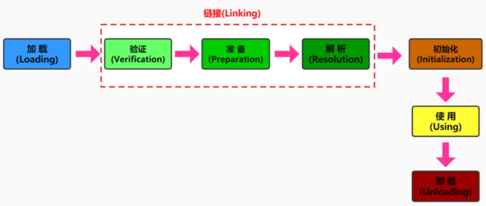

## 类加载分几步？

 按照Java虚拟机规范，从class文件到加载到内存中的类，到类卸载出内存为止，它的整个生命周期包括如下7个阶段：

其中：

①第一过程的加载(loading)也称为装载

②验证、准备、解析 3 个部分统称为链接（Linking）

从程序中类的使用过程看：

 ### 都谁需要加载？

在Java中数据类型分为基本数据类型和引用数据类型。**基本数据类型由虚拟机预先定义，引用数据类型则需要进行类的加载。**

### 面试题

- Java 类加载过程?（苏宁）
- 描述一下 JVM 加载 Class 文件的原理机制?（国美）
- JVM底层怎么加载class文件的？（蚂蚁金服）
- 类加载过程 （蚂蚁金服）
- Java 类加载过程? （百度）
- 描述一下 JVM 加载 Class 文件的原理机制? （蚂蚁金服）
- Java类加载过程  （美团）
- 描述一下JVM加载class文件的原理机制  （美团）
- 什么是类的加载？ （京东）
- 讲一下JVM加载一个类的过程 （京东）

## 过程一：Loading(装载)阶段

### 过程一都做了什么事？

过程一：类的装载
所谓装载，简而言之就是将Java类的字节码文件加载到机器内存中，并在内存中构建出Java类的原型——类模板对象。

装载完成的操作

装载阶段，简言之，查找并加载类的二进制数据，生成Class的实例。

在加载类时，Java虚拟机必须完成以下3件事情：

- 通过类的全名，获取类的二进制数据流。
- 解析类的二进制数据流为方法区内的数据结构（Java类模型）
- 创建java.lang.Class类的实例，表示该类型。作为方法区这个类的各种数据的访问入口

### 过程一中什么是类模板对象

**类模板对象**

所谓类模板对象，其实就是Java类在JVM内存中的一个快照，JVM将从字节码文件中解析出的常量池、类字段、类方法等信息存储到类模板中，这样JVM在运行期便能通过类模板而获取Java类中的任意信息，能够对Java类的成员变量进行遍历，也能进行Java方法的调用。

反射的机制即基于这一基础。如果JVM没有将Java类的声明信息存储起来，则JVM在运行期也无法反射。

**类模型的位置**

加载的类在JVM中创建相应的类结构，类结构会存储在方法区(JDK1.8之前：永久代；JDK1.8及之后：元空间)。

 
