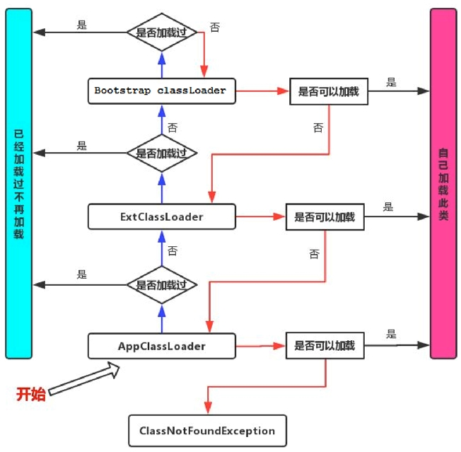

## 双亲委派机制

### 面试题

双亲委派好处有哪些？（亚信）

类加载器双亲委派模型机制？（苏宁）

双亲委派机制 （蚂蚁金服）

双亲委派机制及使用原因 （蚂蚁金服）

类加载器的双亲委派模型是什么？ （蚂蚁金服）

双亲委派模型介绍一下  （小米）

讲一下双亲委派模型，以及其优点  （滴滴）

类加载器的双亲委派模型是什么？ （京东）

### 定义与本质

类加载器用来把类加载到Java虚拟机中。从JDK1.2版本开始，类的加载过程采用双亲委派机制，这种机制能更好地保证Java平台的安全。

1.定义
如果一个类加载器在接到加载类的请求时，它首先不会自己尝试去加载这个类，而是把这个请求任务委托给父类加载器去完成，依次递归，如果父类加载器可以完成类加载任务，就成功返回。只有父类加载器无法完成此加载任务时，才自己去加载。

2.本质
规定了类加载的顺序是：引导类加载器先加载，若加载不到，由扩展类加载器加载，若还加载不到，才会由系统类加载器或自定义的类加载器进行加载。

### 如何证明？源码分析

1.源码分析

双亲委派机[制在java.lang.ClassLoader.loadClass(String,boolean)接口中体现。该接口的逻辑如下：

(1)先在当前加载器的缓存中查找有无目标类，如果有，直接返回。

(2)判断当前加载器的父加载器是否为空，如果不为空，则调用parent.loadClass(name, false)接口进行加载。

(3)反之，如果当前加载器的父类加载器为空，则调用findBootstrapClassOrNull(name)接口，让引导类加载器进行加载。

(4)如果通过以上3条路径都没能成功加载，则调用findClass(name)接口进行加载。该接口最终会调用java.lang.ClassLoader接口的defineClass系列的native接口加载目标Java类。

双亲委派的模型就隐藏在这第2和第3步中。

2.举例

假设当前加载的是java.lang.Object这个类，很显然，该类属于JDK中核心得不能再核心的一个类，因此一定只能由引导类加载器进行加载。当JVM准备加载javaJang.Object时，JVM默认会使用系统类加载器去加载，按照上面4步加载的逻辑，在第1步从系统类的缓存中肯定查找不到该类，于是进入第2步。由于从系统类加载器的父加载器是扩展类加载器，于是扩展类加载器继续从第1步开始重复。由于扩展类加载器的缓存中也一定査找不到该类，因此进入第2步。扩展类的父加载器是null,因此系统调用findClass(String), 最终通过引导类加载器进行加载。

3.思考

如果在自定义的类加载器中重写java.lang.ClassLoader.loadClass(String)或 java.lang.ClassLoader.loadClass(String, boolean)方法,抹去其中的双亲委派机制,仅保留上面这4步中的第1步与第4步，那么是不是就能够加载核心类库了呢？

这也不行！ 因为JDK还为核心类库提供了一层保护机制。不管是自定义的类加载器，还是系统类加载器抑或扩展类加载器，最终都必须调用 java.lang.ClassLoader.defineClass(String, byte[], int, int, ProtectionDomain)方法，而该方法会执行preDefineClass()接口，该接口中提供了对JDK核心类库的保护。

 

 

