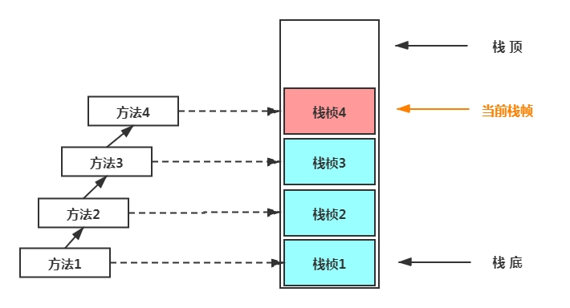
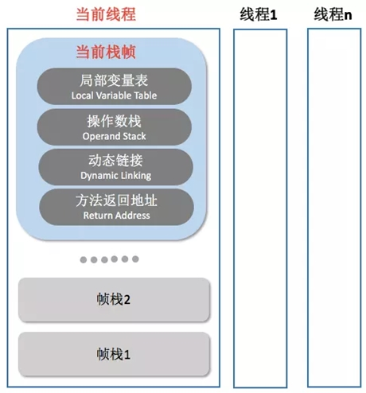
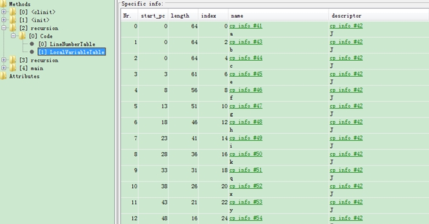
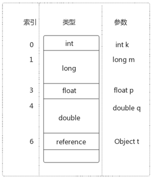
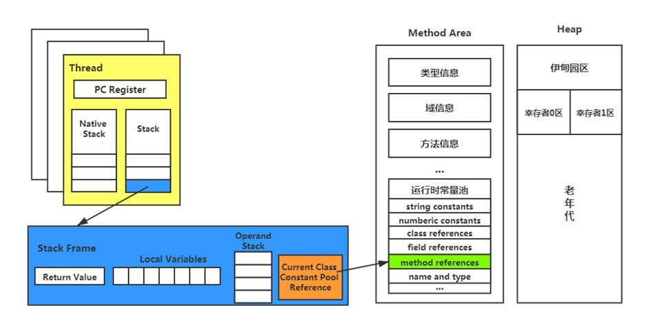

## 概述

### 如何理解栈管运行，堆管存储？

#### 作用

主管Java程序的运行，它保存方法的局部变量(8种基本数据类型、对象的引用地址)、部分结果，并参与方法的调用和返回。

- 局部变量 vs 成员变量(或属性)
- 基本数据变量  vs 引用类型变量（类、数组、接口）

即：栈解决程序的运行问题，即程序如何执行，或者说如何处理数据。堆解决的是数据存储的问题，即数据怎么放、放在哪儿。

#### 面试题

堆和栈的区别、谁的性能更高（艾绒软件）

为什么要把堆和栈区分出来呢？栈中不是也可以存储数据吗？  (阿里)

Java 中堆和栈有什么区别？（国美）

栈和堆的区别？（蚂蚁金服）

角度一：GC;OOM

角度二：栈、堆执行效率

角度三：内存大小；数据结构

角度四：栈管运行；堆管存储。

### 栈存在GC吗

不存在GC ; 存在OOM

### 可能抛出的异常

StackOverFlowError？

OutOfMemoryError？

- Java 虚拟机规范允许<font color = 'red'>Java栈的大小是动态的或者是固定不变的。</font>

  - 如果采用固定大小的Java虚拟机栈，那每一个线程的Java虚拟机栈容量可以在线程创建的时候独立选定。如果线程请求分配的栈容量超过Java虚拟机栈允许的最大容量，Java虚拟机将会抛出一个 StackOverflowError 异常。
  - 如果Java虚拟机栈可以动态扩展，并且在尝试扩展的时候无法申请到足够的内存，或者在创建新的线程时没有足够的内存去创建对应的虚拟机栈，那Java虚拟机将会抛出—个 OutOfMemoryError 异常。

#### 面试题

- 什么情况下会发生栈内存溢出（360）

- 栈存在内存溢出吗 (京东)

- 说一下什么情况发生栈溢出 (滴滴)

一、局部数组过大。当函数内部的数组过大时，有可能导致堆栈溢出。

二、递归调用层次太多。递归函数在运行时会执行压栈操作，当压栈次数太多时，也会导致堆栈溢出。

### 如何设置栈大小

如何设置栈内存的大小？ -Xss size (即：-XX:ThreadStackSize)

- 一般默认为512k-1024k，取决于操作系统。

- 栈的大小直接决定了函数调用的最大可达深度。

  

jdk5.0之前，默认栈大小：256k
jdk5.0之后，默认栈大小：1024k （linux\mac\windows)，Windows上显示的事0，实际上为1024k


#### 面试题

**Java中，栈的大小通过什么参数来设置？  (阿里)**

设置的栈空间值过大，会导致系统可以用于创建线程的数量减少。

一般一个进程中通常有 3000-5000 个线程。

## 栈的单位：栈帧（Stack Frame）

每个线程都有自己的栈，栈中的数据都是以<font color = 'red'>栈帧（Stack Frame）</font>的格式存在。

### 面试题

- 栈是如何运行的（OPPO）
- JVM有哪些组成，堆，栈各放了什么东西。（新浪）
- 怎么理解栈、堆？堆中存什么？栈中存什么？  (阿里)

### 方法和栈帧的关系？

- 在这个线程上正在执行的每个方法都各自对应一个栈帧（Stack Frame）。
- 栈帧是一个内存区块，是一个数据集，维系着方法执行过程中的各种数据信息。




在一条活动线程中，一个时间点上，只会有一个活动的栈帧。即只有当前正在执行的方法的栈帧（栈顶栈帧）是有效的，这个栈帧被称为<font color = 'red'>当前栈帧（Current Frame）</font>，与当前栈帧相对应的方法就是<font color = 'red'>当前方法（Current Method）</font>，定义这个方法的类就是<font color = 'red'>当前类（Current Class）</font>。

如果在该方法中调用了其他方法，对应的新的栈帧会被创建出来，放在栈的顶端，成为新的当前帧。

<font color = 'red'>执行引擎运行的所有字节码指令只针对当前栈帧进行操作。</font>

### 栈的FILO原理


 JVM直接对Java栈的操作只有两个：

- 每个方法执行，伴随着进栈(入栈、压栈)
- 执行结束后的出栈工作

<font color = 'blue'>遵循“先进后出”/“后进先出”原则</font>

- <font color = 'red'>不同线程中所包含的栈帧是不允许存在相互引用的</font>，即不可能在一个栈帧之中引用另外一个线程的栈帧。
- 如果当前方法调用了其他方法，方法返回之际，当前栈帧会传回此方法的执行结果给前一个栈帧，接着，虚拟机会丢弃当前栈帧，使得前一个栈帧重新成为当前栈帧。
- Java方法有两种返回函数的方式，<font color = 'red'>一种是正常的函数返回，使用return指令；另外一种是抛出异常。不管使用哪种方式，都会导致栈帧被弹出。</font>

## 栈桢内部结构

每个栈帧中存储着：

- <font color = 'red'>局部变量表（Local Variables）</font>
- <font color = 'red'>操作数栈（Operand Stack）（或表达式栈）</font>
- 动态链接(Dynamic Linking) （或指向运行时常量池的方法引用）
- 方法返回地址（Return Address）（或方法正常退出或者异常退出的定义）
- 一些附加信息





### 局部变量表（local variables)

- 局部变量表也被称之为局部变量数组或本地变量表
- <font color = 'red'>定义为一个数字数组，主要用于存储方法参数和定义在方法体内的局部变量</font>，这些数据类型包括各类基本数据类型(8种)、对象引用（reference），以及returnAddress类型。
- <font color = 'red'>局部变量表所需的容量大小是在编译期确定下来的</font>，并保存在方法的Code属性的maximum local variables 数据项中。在方法运行期间是不会改变局部变量表的大小的。
- <font color = 'red'>方法嵌套调用的次数由栈的大小决定。</font>一般来说，<font color = 'red'>栈越大，方法嵌套调用次数越多</font>。对一个函数而言，它的参数和局部变量越多，使得局部变量表膨胀，它的栈帧就越大，以满足方法调用所需传递的信息增大的需求。进而函数调用就会占用更多的栈空间，导致其嵌套调用次数就会减少。
- <font color = 'red'>局部变量表中的变量只在当前方法调用中有效</font>。在方法执行时，虚拟机通过使用局部变量表完成参数值到参数变量列表的传递过程。<font color = 'red'>当方法调用结束后，随着方法栈帧的销毁，局部变量表也会随之销毁。</font>



可以看到，在Class文件的局部变量表中，显示了每个局部变量的作用域范围、所在槽位的索引(index列)、变量名(name列)和数据类型(J表示long型)。

 ### 存在线程安全问题吗

由于局部变量表是建立在线程的栈上，是线程的私有数据，因此<font color = 'red'>不存在数据线程安全问题</font>

### 关于Slot的理解

- 参数值的存放总是在局部变量数组的 index 为0开始，到数组长度-1的索引结束。
- 局部变量表，<font color = 'red'>最基本的存储单元是Slot（变量槽）</font>
- 在局部变量表里，<font color = 'red'>32位以内的类型只占用一个slot（包括returnAddress类型），64位的类型（long和double)占用两个slot。</font>
  - byte 、short 、char 在存储前被转换为int，boolean 也被转换为int，0 表示false ，非0 表示true。
  - long 和double 则占据两个Slot。

- JVM会为局部变量表中的每一个Slot都分配一个访问索引，通过这个索引即可成功访问到局部变量表中指定的局部变量值
- 当一个实例方法被调用的时候，它的方法参数和方法体内部定义的局部变量将会<font color = 'red'>按照顺序被复制</font>到局部变量表中的每一个Slot上
- <font color = 'red'>如果需要访问局部变量表中一个64bit的局部变量值时，只需要使用前一个索引即可</font>。(比如：访问long或double类型变量）
- 如果当前帧是由构造方法或者实例方法创建的，那么该对象引用this将会存放在index为0的slot处，其余的参数按照参数表顺序继续排列。



### Slot的重复利用举例？

<font color = 'red'>栈帧中的局部变量表中的槽位是可以重用的</font>，如果一个局部变量过了其作用域，那么在其作用域之后申明的新的局部变量就很有可能会复用过期局部变量的槽位，从而<font color = 'red'>达到节省资源的目的。</font>

```java
public class SlotTest {
    public void localVarl() {
        int a = 0;
        System.out.println(a);
        int b = 0;
    }

    public void localVar2() {
        {
            int a = 0;
            System.out.println(a);
        }
        // 此时的b就会复用a的槽位
        int b = 0;
    }
}
```
### 静态变量与局部变量的对比

- 参数表分配完毕之后，再根据方法体内定义的变量的顺序和作用域分配。
- 我们知道类变量表有两次初始化的机会，第一次是在“<font color = 'red'>准备阶段</font>”，执行系统初始化，对类变量设置零值，另一次则是在“<font color = 'red'>初始化</font>”阶段，赋予程序员在代码中定义的初始值。
- 和类变量初始化不同的是，局部变量表不存在系统初始化的过程，这意味着一旦定义了局部变量则必须人为的初始化，否则无法使用。

```java
public void test() {
    int i;
    System.out.println(i);
}
```

这样的代码是错误的，<font color = 'red'>没有赋值不能够使用。</font>

 ### 与GC Roots的关系

<font color = 'red'>局部变量表中的变量也是重要的垃圾回收根节点，只要被局部变量表中直接或间接引用的对象都不会被回收。</font>


## 操作数栈

### 概念（Operand Stack）

- 我们说Java虚拟机的<font color = 'red'>解释引擎是基于栈的执行引擎</font>，其中的栈指的就是操作数栈。
- 每一个独立的栈帧中除了包含局部变量表以外，还包含一个<font color = 'red'>后进先出</font>（Last-In-First-Out）的操作数栈，也可以称之为<font color = 'red'>表达式栈</font>（Expression Stack）。
- 操作数栈就是JVM执行引擎的一个工作区，当一个方法刚开始执行的时候，一个新的栈帧也会随之被创建出来，这个方法的操作数栈是空的。
- 每一个操作数栈都会拥有一个明确的栈深度用于存储数值，其所需的最大深度<font color = 'red'>在编译期就定义好了</font>，保存在方法的Code属性中，为max_stack的值。
- 栈中的任何一个元素都是可以任意的Java数据类型。
  - 32bit的类型占用一个栈单位深度
  - 64bit的类型占用两个栈单位深度
- <font color = 'red'>操作数栈，在方法执行过程中，根据字节码指令，并非采用访问索引的方式来进行数据访问的</font>，而是只能通过标准的入栈（push）和出栈（pop）操作，往栈中写入数据或提取数据来完成一次数据访问。
  - 某些字节码指令将值压入操作数栈，其余的字节码指令将操作数取出栈。使用它们后再把结果压入栈。比如：执行复制、交换、求和等操作

- 如果被调用的方法带有返回值的话，其返回值将会被压入当前栈帧的操作数栈中，并更新PC寄存器中下一条需要执行的字节码指令。

代码举例
public void testAddOperation() {
    byte i = 15;
    int j = 8;
    int k = i + j;
}
字节码指令信息
public void testAddOperation();
     Code:
     0: bipush        15
     2: istore_1
     3: bipush        8
     5: istore_2
     6: iload_1
     7: iload_2
     8: iadd
     9: istore_3
     10: return

- 操作数栈，<font color = 'red'>主要用于保存计算过程的中间结果，同时作为计算过程中变量临时的存储空间。</font>
- 操作数栈中元素的数据类型必须与字节码指令的序列严格匹配，这由编译器在编译器期间进行验证，同时在类加载过程中的类检验阶段的数据流分析阶段要再次验证。

### 何为栈顶缓存技术？

前面提过，基于栈式架构的虚拟机所使用的零地址指令更加紧凑，但完成一项操作的时候必然需要使用更多的入栈和出栈指令，这同时也就意味着将需要更多的指令分派（instruction dispatch）次数和内存读/写次数。

由于操作数是存储在内存中的，因此频繁地执行内存读/写操作必然会影响执行速度。为了解决这个问题，HotSpot JVM的设计者们提出了栈顶缓存（ToS，Top-of-Stack Cashing）技术，<font color = 'red'>将栈顶元素全部缓存在物理CPU的寄存器中</font>，以此降低对内存的读/写次数，提升执行引擎的执行效率。

## 动态链接

动态链接（或指向运行时常量池的方法引用）

- 每一个栈帧内部都包含一个指向运行时常量池中该栈帧所属方法的引用。包含这个引用的目的就是为了支持当前方法的代码能够实现动态链接（Dynamic Linking）。比如：invokedynamic指令
- 在Java源文件被编译到字节码文件中时，所有的变量和方法引用都作为符号引用（Symbolic Reference）保存在class文件的常量池里。比如：描述一个方法调用了另外的其他方法时，就是通过常量池中指向方法的符号引用来表示的，那么动态链接的作用就是为了将这些符号引用转换为调用方法的直接引用。

```java
public void testGetSum(){
    int i = getSum();
    int j = 10;
}
```



## 方法返回地址

- 存放调用该方法的pc寄存器的值。
- 一个方法的结束，有两种方式：
  - 正常执行完成
  - 出现未处理的异常，非正常退出

- 无论通过哪种方式退出，在方法退出后都返回到该方法被调用的位置。方法正常退出时，<font color = 'red'>调用者的pc计数器的值作为返回地址，即调用该方法的指令的下一条指令的地址</font>。而通过异常退出的，返回地址是要通过异常表来确定，栈帧中一般不会保存这部分信息。

当一个方法开始执行后，只有两种方式可以退出这个方法：

1、执行引擎遇到任意一个方法返回的字节码指令（return），会有返回值传递给上层的方法调用者，简称<font color = 'red'>正常完成出口；</font>

- 一个方法在正常调用完成之后究竟需要使用哪一个返回指令还需要根据方法返回值的实际数据类型而定。
- 在字节码指令中，返回指令包含ireturn（当返回值是boolean、byte、char、short和int类型时使用）、lreturn、freturn、dreturn以及areturn，另外还有一个return指令供声明为void的方法、实例初始化方法、类和接口的初始化方法使用。

2、在方法执行的过程中遇到了异常（Exception），并且这个异常没有在方法内进行处理，也就是只要在本方法的异常表中没有搜索到匹配的异常处理器，就会导致方法退出。简称<font color = 'red'>异常完成出口</font>。

方法执行过程中抛出异常时的异常处理，存储在一个异常处理表，方便在发生异常的时候找到处理异常的代码。
Exception table:
from	to	target	type
4		  16   19     	 any
19	    21   19   	   any

本质上，方法的退出就是当前栈帧出栈的过程。此时，需要恢复上层方法的局部变量表、操作数栈、将返回值压入调用者栈帧的操作数栈、设置PC寄存器值等，让调用者方法继续执行下去。

<font color = 'red'>正常完成出口和异常完成出口的区别在于：通过异常完成出口退出的不会给他的上层调用者产生任何的返回值。</font>

 

 


 


