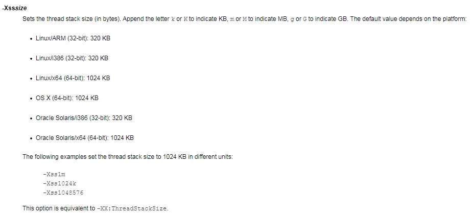
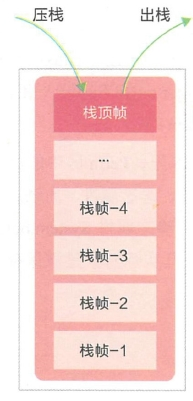

## 概述

### 如何理解栈管运行，堆管存储？

#### 作用

主管Java程序的运行，它保存方法的局部变量(8种基本数据类型、对象的引用地址)、部分结果，并参与方法的调用和返回。

- 局部变量 vs 成员变量(或属性)
- 基本数据变量  vs 引用类型变量（类、数组、接口）

即：栈解决程序的运行问题，即程序如何执行，或者说如何处理数据。堆解决的是数据存储的问题，即数据怎么放、放在哪儿。

#### 面试题

堆和栈的区别、谁的性能更高（艾绒软件）

为什么要把堆和栈区分出来呢？栈中不是也可以存储数据吗？  (阿里)

Java 中堆和栈有什么区别？（国美）

栈和堆的区别？（蚂蚁金服）

角度一：GC;OOM

角度二：栈、堆执行效率

角度三：内存大小；数据结构

角度四：栈管运行；堆管存储。

### 栈存在GC吗

不存在GC ; 存在OOM

### 可能抛出的异常

StackOverFlowError？

OutOfMemoryError？

- Java 虚拟机规范允许Java栈的大小是动态的或者是固定不变的。

  如果采用固定大小的Java虚拟机栈，那每一个线程的Java虚拟机栈容量可以在线程创建的时候独立选定。如果线程请求分配的栈容量超过Java虚拟机栈允许的最大容量，Java虚拟机将会抛出一个 StackOverflowError 异常。

如果Java虚拟机栈可以动态扩展，并且在尝试扩展的时候无法申请到足够的内存，或者在创建新的线程时没有足够的内存去创建对应的虚拟机栈，那Java虚拟机将会抛出—个 OutOfMemoryError 异常。

#### 面试题

- 什么情况下会发生栈内存溢出（360）

- 栈存在内存溢出吗 (京东)

- 说一下什么情况发生栈溢出 (滴滴)

一、局部数组过大。当函数内部的数组过大时，有可能导致堆栈溢出。

二、递归调用层次太多。递归函数在运行时会执行压栈操作，当压栈次数太多时，也会导致堆栈溢出。

### 如何设置栈大小

如何设置栈内存的大小？ -Xss size (即：-XX:ThreadStackSize)

- 一般默认为512k-1024k，取决于操作系统。

- 栈的大小直接决定了函数调用的最大可达深度。

  

jdk5.0之前，默认栈大小：256k
jdk5.0之后，默认栈大小：1024k （linux\mac\windows)

#### 面试题

**Java中，栈的大小通过什么参数来设置？  (阿里)**

设置的栈空间值过大，会导致系统可以用于创建线程的数量减少。

一般一个进程中通常有 3000-5000 个线程。

## 栈的单位：栈帧（Stack Frame）

每个线程都有自己的栈，栈中的数据都是以栈帧（Stack Frame）的格式存在。

### 面试题

- 栈是如何运行的（OPPO）
- JVM有哪些组成，堆，栈各放了什么东西。（新浪）
- 怎么理解栈、堆？堆中存什么？栈中存什么？  (阿里)

### 方法和栈帧的关系？

- 在这个线程上正在执行的每个方法都各自对应一个栈帧（Stack Frame）。
- 栈帧是一个内存区块，是一个数据集，维系着方法执行过程中的各种数据信息。

在一条活动线程中，一个时间点上，只会有一个活动的栈帧。即只有当前正在执行的方法的栈帧（栈顶栈帧）是有效的，这个栈帧被称为当前栈帧（Current Frame），与当前栈帧相对应的方法就是当前方法（Current Method），定义这个方法的类就是当前类（Current Class）。

如果在该方法中调用了其他方法，对应的新的栈帧会被创建出来，放在栈的顶端，成为新的当前帧。

执行引擎运行的所有字节码指令只针对当前栈帧进行操作。

### 栈的FILO原理

 JVM直接对Java栈的操作只有两个：

- 每个方法执行，伴随着进栈(入栈、压栈)
- 执行结束后的出栈工作

遵循“先进后出”/“后进先出”原则

- 不同线程中所包含的栈帧是不允许存在相互引用的，即不可能在一个栈帧之中引用另外一个线程的栈帧。
- 如果当前方法调用了其他方法，方法返回之际，当前栈帧会传回此方法的执行结果给前一个栈帧，接着，虚拟机会丢弃当前栈帧，使得前一个栈帧重新成为当前栈帧。
- Java方法有两种返回函数的方式，一种是正常的函数返回，使用return指令；另外一种是抛出异常。不管使用哪种方式，都会导致栈帧被弹出。

