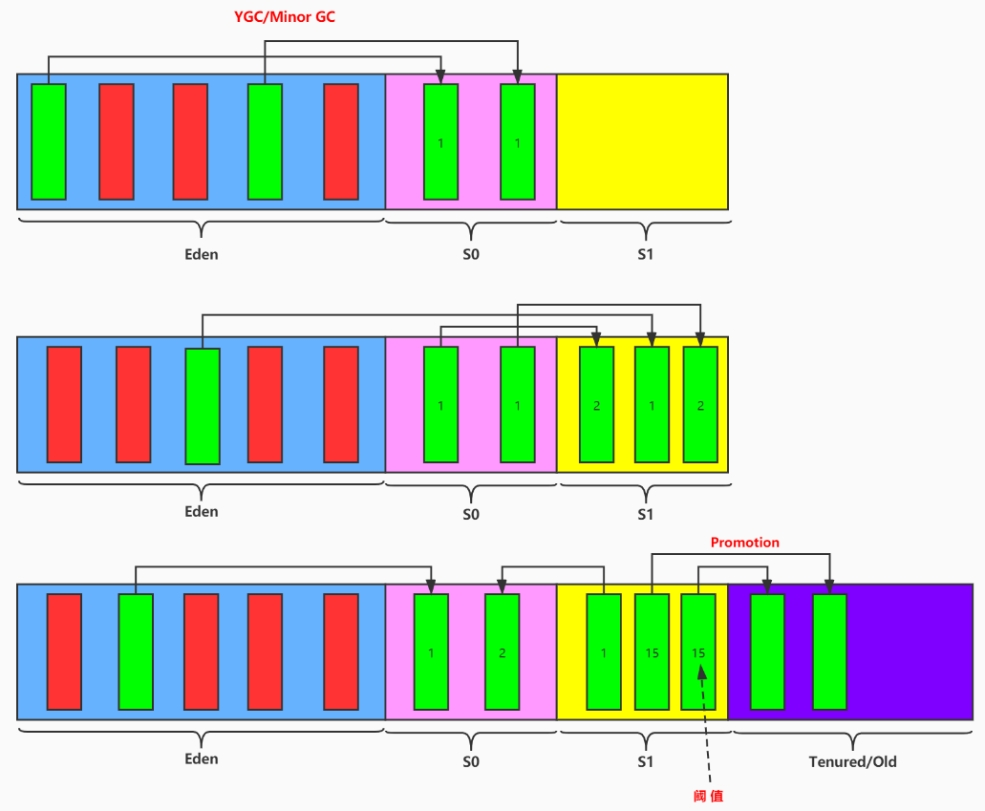

## 核心概述

- 一个JVM实例只存在一个堆内存，堆也是Java内存管理的核心区域。
- Java 堆区在JVM启动的时候即被创建，其空间大小也就确定了。是JVM管理的最大一块内存空间。
- 堆内存的大小是可以调节的。
- 《Java虚拟机规范》规定，堆可以处于<font color = 'red'>物理上不连续</font>的内存空间中，但在<font color = 'red'>逻辑上</font>它应该<font color = 'red'>被视为连续的</font>。

- 堆，是GC ( Garbage Collection，垃圾收集器）执行垃圾回收的重点区域。
- <font color = 'red'>在方法结束后，堆中的对象不会马上被移除，仅仅在垃圾收集的时候才会被移除。</font>

### 对象都分配在堆上吗

- 《Java虚拟机规范》中对Java堆的描述是：所有的对象实例以及数组都应当在运行时分配在堆上。（The heap is the run-time data area from which memory for all class instances and arrays is allocated ) 数组和对象可能永远不会存储在栈上，因为栈帧中保存引用，这个引用指向对象或者数组在堆中的位置。

- 我要说的是：“几乎”所有的对象实例都在这里分配内存。——从实际使用角度看的。

举例：

```java
public class SimpleHeap {
    private int id;

    public SimpleHeap(int id) {
        this.id = id;
    }

    public void show() {
        System.out.println("My ID is " + id);
    }

    public static void main(String[] args) {
        SimpleHeap sl = new SimpleHeap(1);
        SimpleHeap s2 = new SimpleHeap(2);
    }
}
```


### 所有的线程都共享堆吗

所有的线程共享Java堆，在这里还可以划分线程私有的缓冲区（Thread Local Allocation Buffer, TLAB)。

 ## 堆的内部结构

现代垃圾收集器大部分都基于分代收集理论设计，堆空间细分为：


- Java 7及之前堆内存逻辑上分为三部分：新生区+养老区+永久区
- Young Generation Space   新生区      Young/New
  - 又被划分为Eden区和Survivor区
- Tenure generation space  养老区      Old/Tenure
- Permanent Space               永久区      Perm

 

- Java 8及之后堆内存逻辑上分为三部分：**新生区+养老区**+<font color = 'red'>元空间</font>
- Young Generation Space    新生区      Young/New
  - 又被划分为Eden区和Survivor区
- Tenure generation space   养老区      Old/Tenure
- Meta Space                          元空间      Meta

下面叫法都是一个意思：

新生区<=>新生代<=>年轻代  

养老区<=>老年区<=>老年代  

永久区<=>永久代

### <font color = 'red'>面试题</font>

- Java 堆的结构是什么样子的？（猎聘）
- JVM内存为什么要分成新生代，老年代，持久代。新生代中为什么要分为Eden和Survivor（字节跳动）
- 堆里面的分区：Eden，survival （from+ to），老年代，各自的特点。（京东-物流）
- 堆的结构？为什么两个survivor区？  (蚂蚁金服)
- Eden和Survior的比例分配  (蚂蚁金服)
- JVM内存分区，为什么要有新生代和老年代 (小米)
- JVM的内存结构，Eden和Survivor比例。  (京东)
- JVM内存为什么要分成新生代，老年代，持久代。新生代中为什么要分为Eden和Survivor。  (京东)
- JVM内存分区，为什么要有新生代和老年代？  (美团)
- JVM的内存结构，Eden和Survivor比例。  (京东)

### 年轻代与老年代

- 存储在JVM中的Java对象可以被划分为两类：
  - 一类是生命周期较短的瞬时对象，这类对象的创建和消亡都非常迅速
  - 另外一类对象的生命周期却非常长，在某些极端的情况下还能够与JVM的生命周期保持一致。
- Java堆区进一步细分的话，可以划分为年轻代（YoungGen）和老年代（OldGen）
- 其中年轻代又可以划分为Eden空间、Survivor0空间和Survivor1空间（有时也叫做from区、to区）。


- <font color = 'red'>几乎所有的</font>Java对象都是在Eden区被new出来的。
- 绝大部分的Java对象的销毁都在新生代进行了。
- IBM 公司的专门研究表明，新生代中 80% 的对象都是“朝生夕死”的。

## 如何设置堆内存大小

- Java堆区用于存储Java对象实例，那么堆的大小在JVM启动时就已经设定好了，大家可以通过选项”-Xmx”和”-Xms”来进行设置。
  - “-Xms”用于表示堆区的起始内存，等价于-XX:InitialHeapSize
  - “-Xmx”则用于表示堆区的最大内存，等价于-XX:MaxHeapSize
- 一旦堆区中的内存大小超过“-Xmx”所指定的最大内存时，将会抛出OutOfMemoryError:heap异常。
- 通常会将 -Xms 和 -Xmx两个参数配置相同的值，<font color = 'red'>其目的是为了能够在java垃圾回收机制清理完堆区后不需要重新分隔计算堆区的大小，从而提高性能。</font>

- **heap默认最大值计算方式**：如果物理内存少于192M,那么heap最大值为物理内存的一半。如果物理内存大于等于1G，<font color = 'red'>那么heap的最大值为物理内存的1/4。</font>
- **heap默认最小值计算方式**：最少不得少于8M，如果物理内存大于等于1G，<font color = 'red'>那么默认值为物理内存的1/64</font>，即1024/64=16M。最小堆内存在jvm启动的时候就会被初始化。

#############
关于堆空间的大小，我从官网取下来说明：
On Oracle Solaris 7 and Oracle Solaris 8 SPARC platforms, the upper limit for this value is approximately 4,000 MB minus overhead amounts. On Oracle Solaris 2.6 and x86 platforms, the upper limit is approximately 2,000 MB minus overhead amounts. On Linux platforms, the upper limit is approximately 2,000 MB minus overhead amounts.

另：对于32位操作系统，如果物理内存等于4G，那么堆内存可以达到1G。对于64位操作系统，如果物理内存为128G，那么heap最多可以达到32G。

### 面试题

- 堆大小通过什么参数设置？  (阿里)
- 初始堆大小和最大堆大小一样，问这样有什么好处？（亚信）
- JVM中最大堆大小有没有限制？ (阿里)

### 如何设置新生代与老年代比例

下面这参数开发中一般不会调：


- 配置新生代与老年代在堆结构的占比。
  - <font color = 'red'>默认-XX:NewRatio=2</font>，表示新生代占1，老年代占2，新生代占整个堆的1/3
  - 可以修改-XX:NewRatio=4，表示新生代占1，老年代占4，新生代占整个堆的1/5

- 可以使用选项”-Xmn”设置新生代最大内存大小
  - 这个参数一般使用默认值就可以了。

### 如何设置Eden、幸存者区比例

- 在HotSpot中，Eden空间和另外两个Survivor空间缺省所占的比例是8:1:1
- 当然开发人员可以通过选项“-XX:SurvivorRatio”调整这个空间比例。比如-XX:SurvivorRatio=8

### 参数设置小结

#### 面试题

- 什么是空间分配担保策略？（渣打银行）
- 什么是空间分配担保策略？（顺丰）
- 什么是空间分配担保策略？（腾讯、百度）

#### -Xms -Xmx

- 堆空间大小的设置： 

  -Xms:初始内存 （默认为物理内存的1/64）；

  -Xmx:最大内存（默认为物理内存的1/4）；

#### -Xmn

设置新生代的大小。(初始值及最大值)

通常默认即可。

#### -XX:NewRatio

配置新生代与老年代在堆结构的占比。赋的值即为老年代的占比，剩下的1给新生代

默认-XX:NewRatio=2，表示新生代占1，老年代占2，新生代占整个堆的1/3

-XX:NewRatio=4，表示新生代占1，老年代占4，新生代占整个堆的1/5

#### -XX:SurvivorRatio

在HotSpot中，Eden空间和另外两个Survivor空间缺省所占的比例是8：1

开发人员可以通过选项“-XX:SurvivorRatio”调整这个空间比例。比如-XX:SurvivorRatio=8

#### -XX:MaxTenuringThreshold

- 设置新生代垃圾的最大年龄。超过此值，仍未被回收的话，则进入老年代。
- 默认值为15
- -XX:MaxTenuringThreshold=0：表示年轻代对象不经过Survivor区，直接进入老年代。对于老年代比较多的应用，可以提高效率。
- 如果将此值设置为一个较大值，则年轻代对象会在Survivor区进行多次复制，这样可以增加对象在年轻代的存活时间，增加在年轻代即被回收的概率。

#### -XX:+PrintGCDetails

输出详细的GC处理日志


显示如下：
Heap
 PSYoungGen      total 9728K, used 2497K [0x00000000fd580000, 0x00000000fe000000, 0x0000000100000000)
  eden space 8704K, 28% used [0x00000000fd580000,0x00000000fd7f06e8,0x00000000fde00000)
  from space 1024K, 0% used [0x00000000fdf00000,0x00000000fdf00000,0x00000000fe000000)
  to   space 1024K, 0% used [0x00000000fde00000,0x00000000fde00000,0x00000000fdf00000)
 ParOldGen       total 22016K, used 0K [0x00000000f8000000, 0x00000000f9580000, 0x00000000fd580000)
  object space 22016K, 0% used [0x00000000f8000000,0x00000000f8000000,0x00000000f9580000)
 Metaspace       used 3511K, capacity 4498K, committed 4864K, reserved 1056768K
  class space    used 388K, capacity 390K, committed 512K, reserved 1048576K

#### -XX:HandlePromotionFailure

在发生Minor GC之前，虚拟机会检查老年代最大可用的连续空间是否大于新生代所有对象的总空间，

-  如果大于，则此次Minor GC是安全的
-  如果小于，则虚拟机会查看-XX:HandlePromotionFailure设置值是否允许担保失败。
- 如果HandlePromotionFailure=true，那么会继续检查老年代最大可用连续空间是否大于历次晋升到老年代的对象的平均大小，如果大于，则尝试进行一次Minor GC，但这次Minor GC依然是有风险的；如果小于或者HandlePromotionFailure=false，则改为进行一次Full GC。

在JDK 6 Update 24之后，HandlePromotionFailure参数不会再影响到虚拟机的空间分配担保策略，观察OpenJDK中的源码变化，虽然源码中还定义了HandlePromotionFailure参数，但是在代码中已经不会再使用它。JDK 6 Update 24之后的规则变为只要老年代的连续空间大于新生代对象总大小或者历次晋升的平均大小就会进行Minor GC，否则将进行Full GC。

#### -XX:+PrintFlagsFinal

-XX:+PrintFlagsFinal  ：查看所有的参数的最终值（可能会存在修改，不再是初始值）

具体查看某个参数的指令：

 jps：查看当前运行中的进程
 jinfo -flag SurvivorRatio 进程id

## 对象分配金句

为新对象分配内存是一件非常严谨和复杂的任务，JVM的设计者们不仅需要考虑内存如何分配、在哪里分配等问题，并且由于内存分配算法与内存回收算法密切相关，所以还需要考虑GC执行完内存回收后是否会在内存空间中产生内存碎片。

金句：

- <font color = 'red'>针对幸存者s0,s1区的总结：复制之后有交换，谁空谁是to.</font>
- 关于垃圾回收：
  - <font color = 'red'>频繁在新生区收集</font>
  - <font color = 'red'>很少在养老区收集</font>
  - <font color = 'red'>几乎不在永久区/元空间收集</font>

### 面试题

- 什么时候对象会进入老年代？（渣打银行）
- 什么时候对象会进入老年代？（顺丰）
- 幸存者区15次进入老年区，懂原理吗？（58）
- JVM的伊甸园区，from区，to区的比例是否可调？（花旗银行）
- JVM中一次完整的GC流程是怎样的，对象如何晋升到老年代（字节跳动）
- 什么时候对象会进入老年代？  (字节跳动)
- 对象在堆内存创建的生命周期  (蚂蚁金服)
- 重点讲讲对象如何晋升到老年代，几种主要的JVM参数  (蚂蚁金服)
- 新生代和老年代的内存回收策略 (蚂蚁金服)
- 什么时候对象可以被收回？ (蚂蚁金服)

### 过程剖析

1.new的对象先放伊甸园区。此区有大小限制。

2.当伊甸园的空间填满时，程序又需要创建对象，JVM的垃圾回收器将对伊甸园区进行垃圾回收(Minor GC/YGC)，将伊甸园区中的不再被其他对象所引用的对象进行销毁。再加载新的对象放到伊甸园区

3.然后将伊甸园中的剩余对象移动到幸存者0区。

4.如果再次触发垃圾回收，此时上次幸存下来的放到幸存者0区的，如果没有回收，就会放到幸存者1区。

5.如果再次经历垃圾回收，此时会重新放回幸存者0区，接着再去幸存者1区。

6.啥时候能去养老区呢？可以设置次数。默认是15次。

- 可以设置参数：-XX:MaxTenuringThreshold=<N> 设置对象晋升老年代的年龄阈值。

7.在养老区，相对悠闲。当养老区内存不足时，再次触发GC：Major GC，进行养老区的内存清理。

8.若养老区执行了Major GC之后发现依然无法进行对象的保存，就会产生OOM异常
java.lang.OutOfMemoryError: Java heap space

 


 #### 分配策略

内存分配策略（或对象提升(promotion)规则):

如果对象在Eden 出生并经过第一次MinorGC 后仍然存活，并且能被Survivor 容纳的话，将被移动到Survivor 空间中，并将对象年龄设为1 。对象在Survivor 区中每熬过一次MinorGC ， 年龄就增加1岁，当它的年龄增加到一定程度（默认为15 岁，其实每个JVM、每个GC都有所不同）时，就会被晋升到老年代中。

### 内存分配原则

针对不同年龄段的对象分配原则如下所示：

- 优先分配到Eden
- 大对象直接分配到老年代 
  - 尽量避免程序中出现过多的大对象
- 长期存活的对象分配到老年代
- 动态对象年龄判断
  - 如果Survivor 区中相同年龄的所有对象大小的总和大于Survivor空间的一半，年龄大于或等于该年龄的对象可以直接进入老年代，无须等到 MaxTenuringThreshold 中要求的年龄。
- 空间分配担保
  -XX:HandlePromotionFailure

 #### 示例

```java
/** 测试：大对象直接进入老年代
 * -Xms60m -Xmx60m -XX:NewRatio=2 -XX:SurvivorRatio=8 -XX:+PrintGCDetails
 */
public class YoungOldAreaTest {
    public static void main(String[] args) {
        byte[] buffer = new byte[1024 * 1024 * 20];//20m

    }
}
```


 


