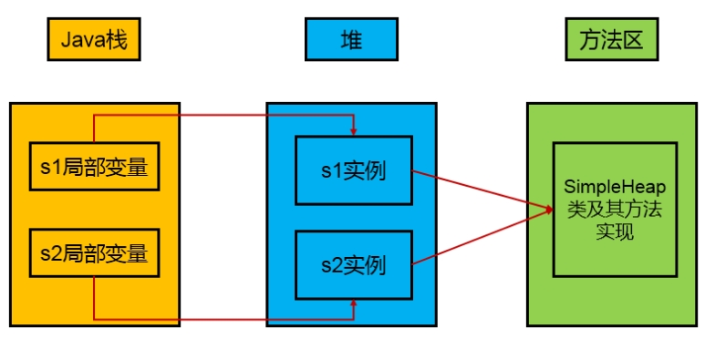

## 核心概述

- 一个JVM实例只存在一个堆内存，堆也是Java内存管理的核心区域。
- Java 堆区在JVM启动的时候即被创建，其空间大小也就确定了。是JVM管理的最大一块内存空间。
- 堆内存的大小是可以调节的。
- 《Java虚拟机规范》规定，堆可以处于<font color = 'red'>物理上不连续</font>的内存空间中，但在<font color = 'red'>逻辑上</font>它应该<font color = 'red'>被视为连续的</font>。

- 堆，是GC ( Garbage Collection，垃圾收集器）执行垃圾回收的重点区域。
- <font color = 'red'>在方法结束后，堆中的对象不会马上被移除，仅仅在垃圾收集的时候才会被移除。</font>

### 对象都分配在堆上吗

- 《Java虚拟机规范》中对Java堆的描述是：所有的对象实例以及数组都应当在运行时分配在堆上。（The heap is the run-time data area from which memory for all class instances and arrays is allocated ) 数组和对象可能永远不会存储在栈上，因为栈帧中保存引用，这个引用指向对象或者数组在堆中的位置。

- 我要说的是：“几乎”所有的对象实例都在这里分配内存。——从实际使用角度看的。

举例：

```java
public class SimpleHeap {
    private int id;

    public SimpleHeap(int id) {
        this.id = id;
    }

    public void show() {
        System.out.println("My ID is " + id);
    }

    public static void main(String[] args) {
        SimpleHeap sl = new SimpleHeap(1);
        SimpleHeap s2 = new SimpleHeap(2);
    }
}
```


### 所有的线程都共享堆吗

所有的线程共享Java堆，在这里还可以划分线程私有的缓冲区（Thread Local Allocation Buffer, TLAB)。

 ## 堆的内部结构

### <font color = 'red'>面试题</font>

- Java 堆的结构是什么样子的？（猎聘）
- JVM内存为什么要分成新生代，老年代，持久代。新生代中为什么要分为Eden和Survivor（字节跳动）
- 堆里面的分区：Eden，survival （from+ to），老年代，各自的特点。（京东-物流）
- 堆的结构？为什么两个survivor区？  (蚂蚁金服)
- Eden和Survior的比例分配  (蚂蚁金服)
- JVM内存分区，为什么要有新生代和老年代 (小米)
- JVM的内存结构，Eden和Survivor比例。  (京东)
- JVM内存为什么要分成新生代，老年代，持久代。新生代中为什么要分为Eden和Survivor。  (京东)
- JVM内存分区，为什么要有新生代和老年代？  (美团)
- JVM的内存结构，Eden和Survivor比例。  (京东)

### 年轻代与老年代

- 存储在JVM中的Java对象可以被划分为两类：
  - 一类是生命周期较短的瞬时对象，这类对象的创建和消亡都非常迅速
  - 另外一类对象的生命周期却非常长，在某些极端的情况下还能够与JVM的生命周期保持一致。
- Java堆区进一步细分的话，可以划分为年轻代（YoungGen）和老年代（OldGen）
- 其中年轻代又可以划分为Eden空间、Survivor0空间和Survivor1空间（有时也叫做from区、to区）。


- <font color = 'red'>几乎所有的</font>Java对象都是在Eden区被new出来的。
- 绝大部分的Java对象的销毁都在新生代进行了。
- IBM 公司的专门研究表明，新生代中 80% 的对象都是“朝生夕死”的。


