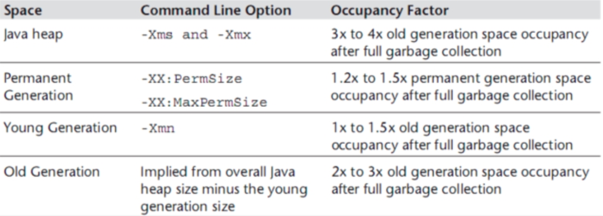

## 合理配置堆内存

### 推荐配置

在案例1中我们讲到了增加内存可以提高系统的性能而且效果显著，那么随之带来的一个问题就是，我们增加多少内存比较合适？如果内存过大，那么如果产生FullGC的时候，GC时间会相对比较长，如果内存较小，那么就会频繁的触发GC，在这种情况下，我们该如何合理的适配堆内存大小呢？

分析：
依据的原则是根据Java Performance里面的推荐公式来进行设置。

Java整个堆大小设置，Xmx 和 Xms设置为老年代存活对象的3-4倍，即FullGC之后的老年代内存占用的3-4倍。

方法区（永久代 PermSize和MaxPermSize 或 元空间 MetaspaceSize 和MaxMetaspaceSize）设置为老年代存活对象的1.2-1.5倍。

年轻代Xmn的设置为老年代存活对象的**1-1.5倍**。

老年代的内存大小设置为老年代存活对象的**2-3倍**。

但是，上面的说法也不是绝对的，也就是说这给的是一个参考值，根据多种调优之后得出的一个结论，大家可以根据这个值来设置一下我们的初始化内存，在保证程序正常运行的情况下，我们还要去查看GC的回收率，GC停顿耗时，内存里的实际数据来判断，Full GC是基本上不能有的，如果有就要做内存Dump分析，然后再去做一个合理的内存分配。

我们还要注意到一点就是，上面说的老年代存活对象怎么去判定。

### 如何计算老年代存活对象

#### 方式1：查看日志

 推荐/比较稳妥！

JVM参数中添加GC日志，GC日志中会记录每次FullGC之后各代的内存大小，观察老年代GC之后的空间大小。可观察一段时间内（比如2天）的FullGC之后的内存情况，根据多次的FullGC之后的老年代的空间大小数据来预估FullGC之后老年代的存活对象大小（可根据多次FullGC之后的内存大小取平均值）。

#### 方式2：强制触发FullGC

会影响线上服务，慎用！

方式1的方式比较可行，但需要更改JVM参数，并分析日志。同时，在使用CMS回收器的时候，有可能不能触发FullGC，所以日志中并没有记录FullGC的日志。在分析的时候就比较难处理。 所以，有时候需要强制触发一次FullGC，来观察FullGC之后的老年代存活对象大小。

注：强制触发FullGC，会造成线上服务停顿（STW），要谨慎！建议的操作方式为，在强制FullGC前先把服务节点摘除，FullGC之后再将服务挂回可用节点，对外提供服务，在不同时间段触发FullGC，根据多次FullGC之后的老年代内存情况来预估FullGC之后的老年代存活对象大小

如何强制触发Full GC?

1、jmap -dump:live,format=b,file=heap.bin <pid> 将当前的存活对象dump到文件，此时会触发FullGC

2、jmap -histo:live <pid> 打印每个class的实例数目,内存占用,类全名信息.live子参数加上后,只统计活的对象数量. 此时会触发FullGC

3、在性能测试环境，可以通过Java监控工具来触发FullGC，比如使用VisualVM和JConsole，VisualVM集成了JConsole，VisualVM或者JConsole上面有一个触发GC的按钮。

### 案例演示

#### JVM配置参数

现在我们通过idea启动springboot工程，我们将内存初始化为1024M。我们这里就从1024M的内存开始分析我们的GC日志，根据我们上面的一些知识来进行一个合理的内存设置。

JVM设置如下：
-XX:+PrintGCDetails -XX:MetaspaceSize=64m -Xss512K -XX:+HeapDumpOnOutOfMemoryError -XX:HeapDumpPath=heap/heapdump3.hprof  -XX:SurvivorRatio=8  -XX:+PrintGCDateStamps  -Xms1024M  -Xmx1024M -Xloggc:log/gc-oom3.log

 

