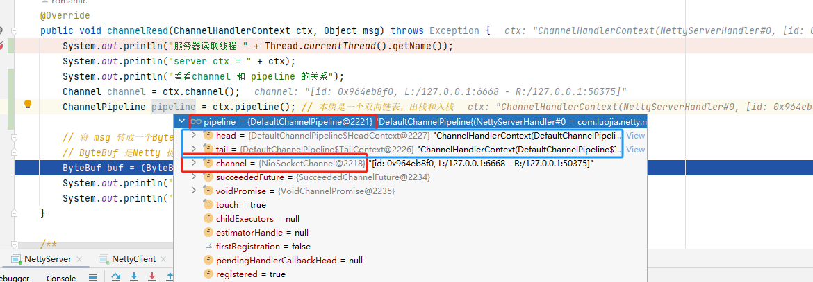
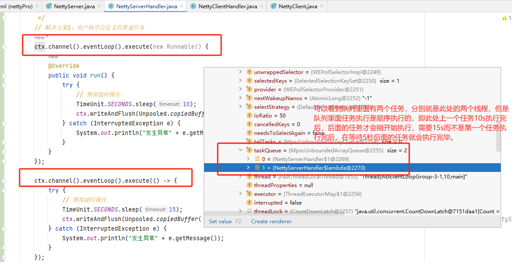

# Netty模型

### 工作原理示意图1-简单版

Netty主要基于主从 Reactors 多线程模型（如图）做了一定的改进，其中主从 Reactor 多线程模型有多个 Reactor


### 工作原理示意图2-进阶版

Netty主要基于主从Reactors 多线程模型(如图)做了一定的改进，其中主从 Reactor 多线程模型有多个 Reactor


 ### 工作原理示意图3-详细版


上图中NioEventGroup应该是NioEventLoop才对，每一个NioEvent都在不断的循环，然后过多NioEventLoop 才组成了NioEventGroup

1. Netty抽象出两组线程池 BossGroup专门负责接收客户端的连接，WorkerGroup 专门负责网络的读写
2. BossGroup和 WorkerGroup 类型都是 NioEventLoopGroup
3. NioEventLoopGroup 相当于一个事件循环组，这个组中含有多个事件循环，每一个事件循环是 NioEventLoop
4. NioEventLoop 表示一个不断循环的执行处理任务的线程，每个NioEventLoop都有一个selector,用于监听绑定在其上的socket的网络通讯
5. NioEventLoopGroup 可以有多个线程,即可以含有多个NioEventLoop
6. 每个Boss NioEventLoop循环执行的步骤有3步
   - 轮询accept事件
   - 处理accept事件，与client建立连接，生成**NioScocketChannel**，并将其注册到某个worker NlOEventLoop上的selector
   - 处理任务队列的任务，即runAllTasks
7. 每个Worker NIOEventLoop循环执行的步骤
   - 轮询read,write 事件
   - 处理i/o事件，在对应NioScocketChannel处理事件，即read,write事件
   - 处理任务队列的任务，即runAllTasks
8. 每个Worker NlOEventLoop 处理业务时，会使用pipeline(管道),pipeline 中包含了 channel,即通过pipeline 可以获取到对应通道,管道中维护了很多的 处理器

---

设置NioEventLoopGroup 线程大小，不设置默认是CPU核数*2

此处意思为设置bossGroup 线程数为1，workerGroup线程数为2

```java
// bossGroup 和 workerGroup 含有的子线程(NioEventLoop)的个数，默认是 CPU 核数 * 2
NioEventLoopGroup bossGroup = new NioEventLoopGroup(1);
NioEventLoopGroup workerGroup = new NioEventLoopGroup(2);
```


此图可以看出workerGroup线程数为2，同时每一个worker线程都有单独的一个Selector


同时，当客户端连接个数超过定义线程个数时，会发现worker线程并不会由于之前的请求而一直阻塞，实现了线程的复用


观察channel管道和 pipeline之间的关系(其实他们就是你中有我，我中有你的关系)


pipeline：pipeline 其实是一个双向链表，里面有头节点有尾节点，并且也有当前channel的信息



### 任务队列中的Task有三种典型使用场景

1）用户程序自定义的普通任务

taskqueue参数查看方法：找到ctx -> pipeline -> channel -> eventLoop -> taskQueue



2）用户自定义定时任务

scheduleTaskQueue 参数查看方法：找到ctx -> pipeline -> channel -> eventLoop -> scheduleTaskQueue


### Netty 模型方案再说明

Netty抽象出**两组线程池**，BossGroup专门负责接收客户端连接，WorkerGroup 专门负击网络读写操作。

NioEventloop表示一个不断循环执行处理任务的线程，每个NioEventLoop都有一个selector，用于监听绑定在其上的 socket 网络通道。

NioEventloop内部采用**串行化设计**，从消息的读取->解码->处理->编码->发送，始终由IO 线程 NioEventLoop负责

- NioEventLoopGroup下包含多个NioEventLoop
- 每个 NioEventLoop中包含有一个Selector，taskQueue
- 每个NioEventLoop的Selector上可以注册监听多个NioChannel
- 每个NioChannel只会绑定在唯一的NioEventLoop上
- 每个 NioChannel都绑定有一个自己的ChannelPipeline

---

### 代码分析

NettyServer

```Java
package com.luojia.netty.nettypro.netty.simple;

import io.netty.bootstrap.ServerBootstrap;
import io.netty.channel.ChannelFuture;
import io.netty.channel.ChannelInitializer;
import io.netty.channel.ChannelOption;
import io.netty.channel.nio.NioEventLoopGroup;
import io.netty.channel.socket.SocketChannel;
import io.netty.channel.socket.nio.NioServerSocketChannel;

public class NettyServer {
    public static void main(String[] args) throws InterruptedException {

        // 创建bossGroup和workGroup
        // bossGroup只是处理连接请求，真正的和客户端业务处理请求会交给workerGroup完成
        // 两个都是无限循环
        // bossGroup 和 workerGroup 含有的子线程(NioEventLoop)的个数，默认是 CPU 核数 * 2
        NioEventLoopGroup bossGroup = new NioEventLoopGroup(1);
        NioEventLoopGroup workerGroup = new NioEventLoopGroup(2);

        // 创建服务器端的启动对象，配置参数
        ServerBootstrap bootstrap = new ServerBootstrap();

        try {
            // 使用链式编程来进行设置
            bootstrap.group(bossGroup, workerGroup) // 设置两个线程组
                    .channel(NioServerSocketChannel.class) // 使用 NioServerSocketChannel 作为服务器的通道实现
                    .option(ChannelOption.SO_BACKLOG, 128) // 设置线程队列等待连接个数
                    .childOption(ChannelOption.SO_KEEPALIVE, true) // 设置保持活动连接状态
                    .childHandler(new ChannelInitializer<SocketChannel>() {
                        // 给pipeline 设置处理器
                        @Override
                        protected void initChannel(SocketChannel ch) throws Exception {
                            ch.pipeline().addLast(new NettyServerHandler());
                        }
                    }); // 给我们的workGroup 的EventLoop 对应的管道设置处理器
            System.out.println("... 服务器 is ready...");
            // 绑定一个端口并且同步，生成一个 ChannelFuture 对象
            ChannelFuture cf = bootstrap.bind(6668).sync();
            // 对关闭通道进行监听
            cf.channel().closeFuture().sync();
        } finally {
            bossGroup.shutdownGracefully();
            workerGroup.shutdownGracefully();
        }
    }
}
```

NettyServerHandler

```Java
package com.luojia.netty.nettypro.netty.simple;

import io.netty.buffer.ByteBuf;
import io.netty.buffer.Unpooled;
import io.netty.channel.Channel;
import io.netty.channel.ChannelHandlerContext;
import io.netty.channel.ChannelInboundHandlerAdapter;
import io.netty.channel.ChannelPipeline;
import io.netty.util.CharsetUtil;

import java.util.concurrent.TimeUnit;

/**
 * 我们自定义一个Handler 需要继承netty 规定好的某个HandlerAdapter(规范)
 * 这时我们自定义一个Handler，才能称为一个handler
 */
public class NettyServerHandler extends ChannelInboundHandlerAdapter {

    /**
     * 读取数据（这里读取客户端发送的消息）
     * @param ctx 上下文对象，含有管道pipeline， 通道Channel，地址
     * @param msg 客户端发送的数据，默认Object
     * @throws Exception
     */
    @Override
    public void channelRead(ChannelHandlerContext ctx, Object msg) throws Exception {
        // 1.正常读写
        System.out.println("服务器读取线程 " + Thread.currentThread().getName());
        System.out.println("server ctx = " + ctx);
        System.out.println("看看channel 和 pipeline 的关系");
        Channel channel = ctx.channel();
        ChannelPipeline pipeline = ctx.pipeline(); // 本质是一个双向链表，出栈和入栈

        // 将 msg 转成一个ByteBuf
        // ByteBuf 是Netty 提供的，不是NIO的 ByteBuffer
        ByteBuf buf = (ByteBuf) msg;
        System.out.println("客户端发送消息是：" + buf.toString(CharsetUtil.UTF_8));
        System.out.println("客户端地址：" + ctx.channel().remoteAddress());

        // 2. 如果这里是一个非常耗时的业务 -> 异步执行 -> 提交该channel对应的 NIOEventLoop 的 taskQueue中
        /**
         * TimeUnit.SECONDS.sleep(10);
         * ctx.writeAndFlush(Unpooled.copiedBuffer("hello 这是一个耗时的操作", CharsetUtil.UTF_8));
         */
        // 解决方案1，用户程序自定义的普通任务
        ctx.channel().eventLoop().execute(new Runnable() {
            @Override
            public void run() {
                try {
                    // 模拟超时操作
                    TimeUnit.SECONDS.sleep(3);
                    ctx.writeAndFlush(Unpooled.copiedBuffer("hello 这是一个耗时的操作", CharsetUtil.UTF_8));
                } catch (InterruptedException e) {
                    System.out.println("发生异常" + e.getMessage());
                }
            }
        });

        ctx.channel().eventLoop().execute(() -> {
            try {
                // 模拟超时操作
                TimeUnit.SECONDS.sleep(5);
                ctx.writeAndFlush(Unpooled.copiedBuffer("hello 这是另一个耗时的操作", CharsetUtil.UTF_8));
            } catch (InterruptedException e) {
                System.out.println("发生异常" + e.getMessage());
            }
        });

        // 用户自定义定时任务 -> 该任务是提交到 scheduleTaskQueue 中
        ctx.channel().eventLoop().schedule(() -> {
            try {
                // 模拟超时操作
                TimeUnit.SECONDS.sleep(5);
                ctx.writeAndFlush(Unpooled.copiedBuffer("hello 这是 scheduleTaskQueue 的操作", CharsetUtil.UTF_8));
            } catch (InterruptedException e) {
                System.out.println("发生异常" + e.getMessage());
            }
        }, 5, TimeUnit.SECONDS);

        System.out.println("go on ...");

    }

    /**
     * 数据读取完后，执行的操作
     * @param ctx
     * @throws Exception
     */
    @Override
    public void channelReadComplete(ChannelHandlerContext ctx) throws Exception {
        // writeAndFlush 是 write和flush
        // 将数据写入缓存并刷新，一般我们需要对发送的数据进行编码
        ctx.writeAndFlush(Unpooled.copiedBuffer("hello, 客户端", CharsetUtil.UTF_8));
    }

    // 处理异常，需要关闭通道
    @Override
    public void exceptionCaught(ChannelHandlerContext ctx, Throwable cause) throws Exception {
        ctx.close();
    }
}
```

NettyClient

```Java
package com.luojia.netty.nettypro.netty.simple;

import io.netty.bootstrap.Bootstrap;
import io.netty.bootstrap.ServerBootstrap;
import io.netty.channel.ChannelFuture;
import io.netty.channel.ChannelInitializer;
import io.netty.channel.nio.NioEventLoopGroup;
import io.netty.channel.socket.SocketChannel;
import io.netty.channel.socket.nio.NioSocketChannel;

public class NettyClient {
    public static void main(String[] args) throws InterruptedException {

        // 客户端需要一个事件循环组
        NioEventLoopGroup group = new NioEventLoopGroup();

        try {
            // 创建客户端启动对象
            // 注意客户端使用的不是 ServerBootstrap 而是 Bootstrap
            Bootstrap bootstrap = new Bootstrap();
            bootstrap.group(group) // 设置线程组
                    .channel(NioSocketChannel.class) // 设置客户端通道的视线类(反射)
                    .handler(new ChannelInitializer<SocketChannel>() {
                        @Override
                        protected void initChannel(SocketChannel socketChannel) throws Exception {
                            // 加入自己的处理器
                            socketChannel.pipeline().addLast(new NettyClientHandler());
                        }
                    });

            System.out.println("客户端 OK ...");

            // 启动客户端连接服务端
            // 关于 ChannelFuture 要分析，设计到netty 的异步模型
            ChannelFuture channelFuture = bootstrap.connect("127.0.0.1", 6668).sync();
            // 对关闭进行监听
            channelFuture.channel().closeFuture().sync();
        } finally {
            group.shutdownGracefully();
        }
    }
}
```

NettyClientHandler

```Java
package com.luojia.netty.nettypro.netty.simple;

import io.netty.buffer.ByteBuf;
import io.netty.buffer.Unpooled;
import io.netty.channel.ChannelHandlerContext;
import io.netty.channel.ChannelInboundHandlerAdapter;
import io.netty.util.CharsetUtil;

import java.nio.charset.StandardCharsets;

public class NettyClientHandler extends ChannelInboundHandlerAdapter {

    /**
     * 当通道就绪就触发该方法
     * @param ctx
     * @throws Exception
     */
    @Override
    public void channelActive(ChannelHandlerContext ctx) throws Exception {
        System.out.println("client " + ctx);
        ctx.writeAndFlush(Unpooled.copiedBuffer("hello, server: 你好", StandardCharsets.UTF_8));
    }

    /**
     * 读取数据，当通道有数据时触发
     * @param ctx 上下文对象，含有管道pipeline， 通道Channel，地址
     * @param msg 客户端发送的数据，默认Object
     * @throws Exception
     */
    @Override
    public void channelRead(ChannelHandlerContext ctx, Object msg) throws Exception {
        System.out.println("client ctx = " + ctx);
        // 将 msg 转成一个ByteBuf
        // ByteBuf 是Netty 提供的，不是NIO的 ByteBuffer
        ByteBuf buf = (ByteBuf) msg;
        System.out.println("服务器回复的消息：" + buf.toString(CharsetUtil.UTF_8));
        System.out.println("服务器地址：" + ctx.channel().remoteAddress());
    }

    @Override
    public void exceptionCaught(ChannelHandlerContext ctx, Throwable cause) throws Exception {
        ctx.close();
    }
}
```

