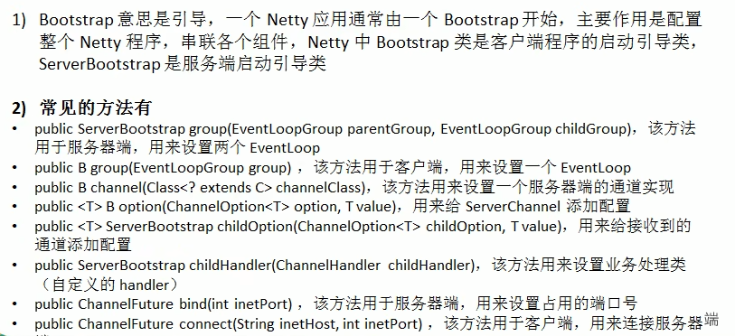
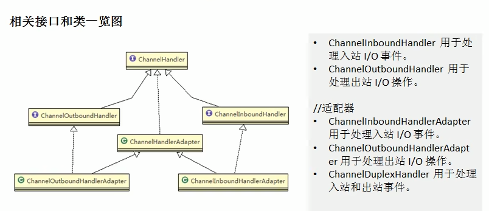

### Bootstrap、ServerBootstrap

### Future、ChannelFuture

Netty 中所有的 IO 操作都是异步的，不能立刻得知消息是否被正确处理。但是可以过一会等它执行完成或者直接注册一个监听，具体的实现就是通过Future 和Channelfutures，他们可以注册一个监听，当操作执行成功或失败时监听会自动触发注册的监听事件

**常见的方法有**

-  Channelchannel()，返回当前正在进行 IO操作的通道
- ChannelFuturesync()，等待异步操作执行完毕

### Channel

- Netty网络通信的组件，能够用于执行网络 I/O操作。

- 通过Channel可获得当前网络连接的通道的状态

- 通过Channel可获得 网络连接的配置参数(例如接收缓冲区大小)

- Channel提供异步的网络 I/0 操作(如建立连接，读写，绑定端口)，异步调用意味着任何 I/O调用都将立即返回，并且不保证在调用结束时所请求的 I/O 操作已完成

- 调用立即返回一个 ChannelFuture实例，通过注册监听器到 ChannelFuture上，可以I/O 操作成功、失败或取消时回调通知调用方

- 支持关联 I/O 操作与对应的处理程序

- 不同协议、不同的阻塞类型的连接都有不同的 Channel 类型与之对应，常用的 Channel类型：

  NioSocketChannel，异步的客户端 TCP Socket 连接。

  NioServerSocketChannel，异步的服务器端TCP Socket 连接。

  NioDatagramChannel，异步的UDP连接。

  NioSctpChannel，异步的客户端Sctp 连接，这些通道涵盖了 UDP 和TCP 网络 IO以及文件IO。

### Selector

Netty基于 Selector 对象实现 I/0 多路复用，通过 Selector 一个线程可以监听多个连接的 Channel事件。

当向一个 Selector 中注册 Channel后，Selector 内部的机制就可以自动不断地査询(Select) 这些注册的 Channel是否有已就绪的 I/0 事件(例如可读，可写，网络连接完成等)，这样程序就可以很简单地使用一个线程高效地管理多个Channel

### ChannelHandler 及其实现类

ChannelHandler是一个接口，处理 I/O事件或拦截 I/O 操作，并将其转发到其ChannelPipeline(业务处理链)中的下一个处理程序。

ChannelHandler本身并没有提供很多方法，因为这个接口有许多的方法需要实现，方便使用期间，可以继承它的子类

ChannelHandler及其实现类一览图

### Pipeline 和 ChannelPipeline

ChannelPipeline是一个重点:

1）ChannelPipeline是一个Handler 的集合，它负责处理和拦截 inbound 或者outbound的事件和操作，相当于一个贯穿 Netty的链。(**也可以这样理解:ChannelPipeline是保存 ChannelHandler的 List，用于处理或拦截 Channel的入站事件和出站操作**)

2）ChannelPipeline实现了一种高级形式的拦截过滤器模式，使用户可以完全控制事件的处理方式，以及 Channel中各个的ChannelHandler如何相互交互

