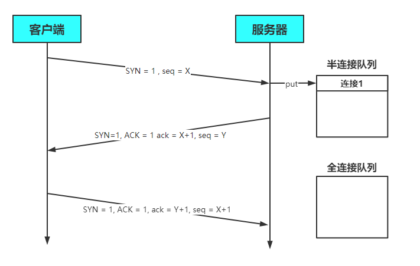
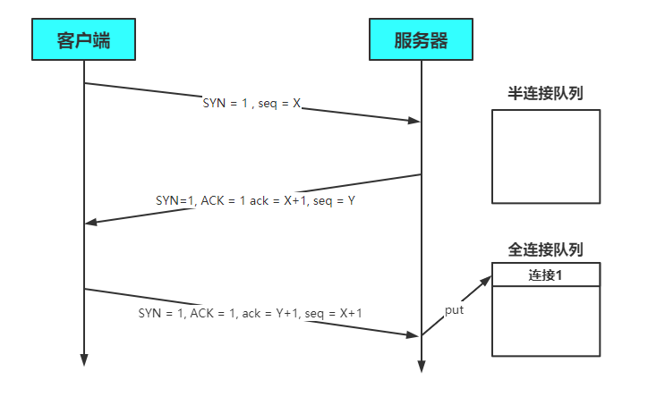
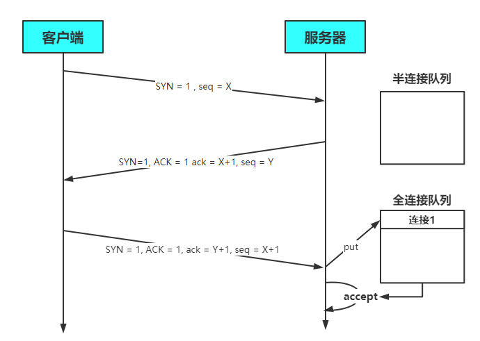

# 参数调优

### 1. CONNECT_TIMEOUT_MILLIS

- 属于 SocketChannal 参数
- **用在客户端建立连接时**，如果在指定毫秒内无法连接，会抛出 timeout 异常
- SO_TIMEOUT 主要用在阻塞 IO，阻塞 IO 中 accept，read 等都是无限等待的，如果不希望永远阻塞，使用它调整超时时间

```java
@Slf4j
public class TestConnectionTimeout {
    public static void main(String[] args) {
        // ServerBootstrap serverBootstrap = new ServerBootstrap();
        // 是给 ServerSocketChannel 配置参数
        // ServerBootstrap option = serverBootstrap.option();
        // 是给 SocketChannel 配置参数
        // serverBootstrap.childOption();
        
        NioEventLoopGroup group = new NioEventLoopGroup();
        try {
            Bootstrap bootstrap = new Bootstrap()
                    .group(group)
                	// SocketChannel 300ms内未建立连接就抛出异常
                    .option(ChannelOption.CONNECT_TIMEOUT_MILLIS, 300)
                    .channel(NioSocketChannel.class)
                    .handler(new LoggingHandler());
            ChannelFuture future = bootstrap.connect("127.0.0.1", 8080);
            future.sync().channel().closeFuture().sync(); // 断点1
        } catch (Exception e) {
            e.printStackTrace();
            log.debug("timeout");
        } finally {
            group.shutdownGracefully();
        }
    }
}
```

- 客户端通过 `Bootstrap.option` 函数来配置参数，**配置参数作用于 SocketChannel**
- 服务器通过 ServerBootstrap 来配置参数，但是对于不同的 Channel 需要选择不同的方法
  - 通过 `option` 来配置 **ServerSocketChannel** 上的参数
  - 通过 `childOption` 来配置 **SocketChannel** 上的参数

#### 源码分析

客户端中连接服务器的线程是 NIO 线程，抛出异常的是主线程。这是如何做到超时判断以及线程通信的呢？

`AbstractNioChannel.AbstractNioUnsafe.connect`方法中

```java
public final void connect(
                final SocketAddress remoteAddress, final SocketAddress localAddress, final ChannelPromise promise) {
    
    ...
        
    // Schedule connect timeout.
    // 设置超时时间，通过option方法传入的CONNECT_TIMEOUT_MILLIS参数进行设置
    int connectTimeoutMillis = config().getConnectTimeoutMillis();
    // 如果超时时间大于0
    if (connectTimeoutMillis > 0) {
        // 创建一个定时任务，延时connectTimeoutMillis（设置的超时时间时间）后执行
        // schedule(Runnable command, long delay, TimeUnit unit)
        connectTimeoutFuture = eventLoop().schedule(new Runnable() {
            @Override
            public void run() {
                // 判断是否建立连接，Promise进行NIO线程与主线程之间的通信
                // 如果超时，则通过tryFailure方法将异常放入Promise中
                // 在主线程中抛出
                ChannelPromise connectPromise = AbstractNioChannel.this.connectPromise;
                ConnectTimeoutException cause = new ConnectTimeoutException("connection timed out: " + remoteAddress);
                if (connectPromise != null && connectPromise.tryFailure(cause)) {
                    close(voidPromise());
                }
            }
        }, connectTimeoutMillis, TimeUnit.MILLISECONDS);
    }
   	...
}
```

超时的判断**主要是通过 Eventloop 的 schedule 方法和 Promise 共同实现的**

- schedule 设置了一个定时任务，延迟`connectTimeoutMillis`秒后执行该方法
- 如果指定时间内没有建立连接，则会执行其中的任务，任务负责创建 `ConnectTimeoutException` 异常，并将异常通过 Pormise 传给主线程并抛出

### 2. SO_BACKLOG

该参数是 **ServerSocketChannel** 的参数

#### 三次握手与连接队列

1. 第一次握手，client 发送 SYN 到 server，状态修改为 SYN_SEND，server 收到，状态改变为 SYN_REVD，并将该请求放入 sync queue 队列(半连接队列)

   

2. 第二次握手，server 回复 SYN + ACK 给 client，client 收到，状态改变为 ESTABLISHED，并发送 ACK 给 server

3. 第三次握手，server 收到 ACK，状态改变为 ESTABLISHED，将该请求从 sync queue (半连接) 放入 accept queue(全连接)

   

4. 服务器处理Accept事件是在TCP三次握手，也就是建立连接之后。服务器会**从全连接队列中获取**连接并进行处理

   

在 linux 2.2 之前，backlog 大小包括了两个队列的大小，**在 linux 2.2 之后，分别用下面两个参数来控制**

- 半连接队列 - sync queue
  - 大小通过 /proc/sys/net/ipv4/tcp_max_syn_backlog 指定，在 `syncookies` 启用的情况下，逻辑上没有最大值限制，这个设置便被忽略
- 全连接队列 - accept queue
  - 其大小通过 /proc/sys/net/core/somaxconn 指定，在使用 listen 函数时，**内核会根据传入的 backlog 参数与系统参数，取二者的较小值**
  - 如果 accpet queue 队列满了，server 将发送一个拒绝连接的错误信息到 client

#### 作用

在Netty中，`SO_BACKLOG `主要用于设置全连接队列的大小。**当处理Accept的速率小于连接建立的速率时，全连接队列中堆积的连接数大于`SO_BACKLOG`设置的值是，便会抛出异常**（因为accept连接之后，会把数据从全连接中移除）

模拟演示时，可以设置 `ServerBootstrap` 的 option参数小一点

```java
new ServerBootstrap().option(ChannelOption.SO_BACKLOG, 2);
```

backlog参数在`NioSocketChannel.doBind`方法被使用

```java
@Override
protected void doBind(SocketAddress localAddress) throws Exception {
    if (PlatformDependent.javaVersion() >= 7) {
        javaChannel().bind(localAddress, config.getBacklog());
    } else {
        javaChannel().socket().bind(localAddress, config.getBacklog());
    }
}
```

其中backlog被保存在了`DefaultServerSocketChannelConfig`配置类中

```java
private volatile int backlog = NetUtil.SOMAXCONN;
// 具体的赋值操作如下
SOMAXCONN = AccessController.doPrivileged(new PrivilegedAction<Integer>() {
    @Override
    public Integer run() {
        // Determine the default somaxconn (server socket backlog) value of the platform.
        // The known defaults:
        // - Windows NT Server 4.0+: 200
        // - Linux and Mac OS X: 128
        int somaxconn = PlatformDependent.isWindows() ? 200 : 128;
        File file = new File("/proc/sys/net/core/somaxconn");
        BufferedReader in = null;
        try {
            // file.exists() may throw a SecurityException if a SecurityManager is used, so execute it in the
            // try / catch block.
            // See https://github.com/netty/netty/issues/4936
            if (file.exists()) {
                in = new BufferedReader(new FileReader(file));
                // 将somaxconn设置为Linux配置文件中设置的值
                somaxconn = Integer.parseInt(in.readLine());
                if (logger.isDebugEnabled()) {
                    logger.debug("{}: {}", file, somaxconn);
                }
            } else {
                ...
            }
            ...
        }  
        // 返回backlog的值
        return somaxconn;
    }
}
```

- backlog的值会根据操作系统的不同，来选择不同的默认值
  - Windows 200
  - Linux/Mac OS 128
- **如果配置文件`/proc/sys/net/core/somaxconn`存在**，会读取配置文件中的值，并将backlog的值设置为配置文件中指定的


