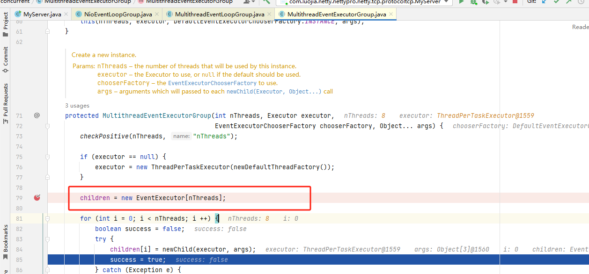
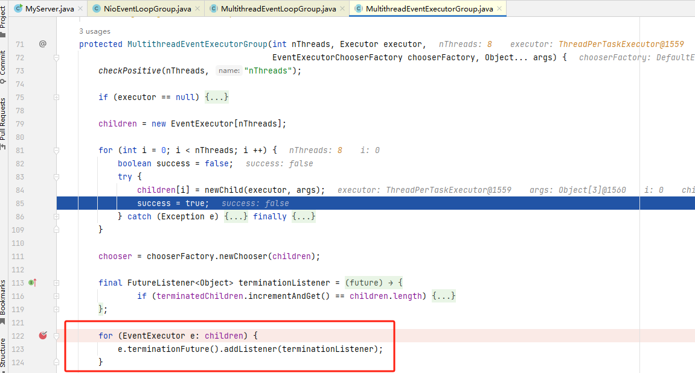
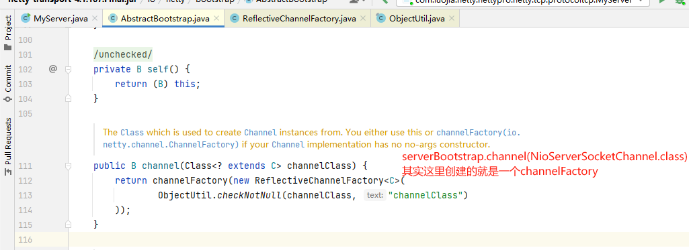
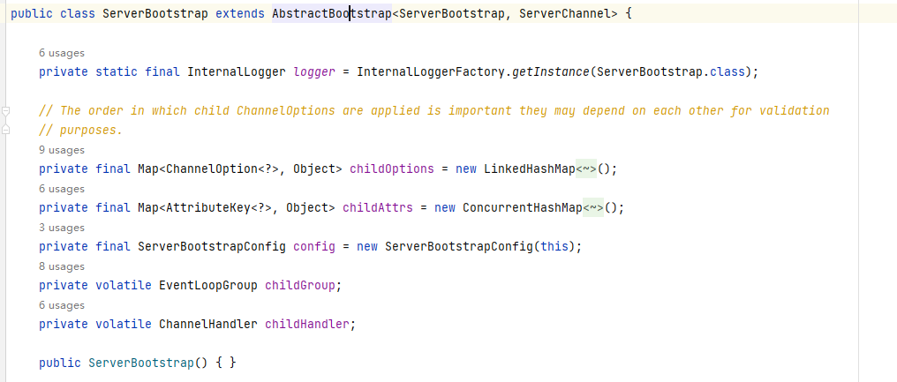
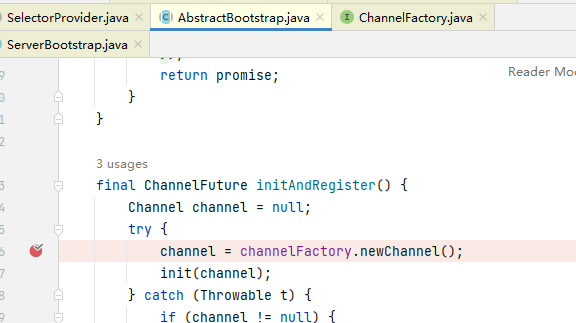

# 基本说明

1) 只有看过Netty源码，才能说是真的掌握了Netty框架。

2) 在 io.netty.example.echo 包下，有很多Netty源码案例，可以用来分析

## Netty 启动过程源码剖析

### 启动剖析

下面来看看 Netty 中对下面代码是怎样进行处理的

```java
// 1.netty 中使用 NioEventLoopGroup （简称 nio boss 线程）来封装线程和 selector
Selector selector = Selector.open(); 

// 2.创建 NioServerSocketChannel，同时会初始化它关联的 handler，以及为原生 ssc 存储 config
NioServerSocketChannel attachment = new NioServerSocketChannel();

// 3.创建 NioServerSocketChannel 时，创建了 java 原生的 ServerSocketChannel
ServerSocketChannel serverSocketChannel = ServerSocketChannel.open(); 
serverSocketChannel.configureBlocking(false);

// 4.启动 nio boss 线程执行接下来的操作

// 5.注册（仅关联 selector 和 NioServerSocketChannel），未关注事件
SelectionKey selectionKey = serverSocketChannel.register(selector, 0, attachment);

// 6.head -> 初始化器 -> ServerBootstrapAcceptor -> tail，初始化器是一次性的，只为添加 acceptor

// 7.绑定端口
serverSocketChannel.bind(new InetSocketAddress(8080));

// 8.触发 channel active 事件，在 head 中关注 op_accept 事件
selectionKey.interestOps(SelectionKey.OP_ACCEPT);
```


### 源码剖析

1）源码需要剖析到Netty 调用doBind方法，追踪到 NioServerSocketChannel的doBind

2）并且要Debug 程序到 NioEventloop类的<font color = 'red'>run代码，无限循环</font>，在服务器端运行。

### 说明

重点分析下创建了两个EventLoopGroup 对象:

```java
EventLoopGroup bossGroup = new NioEventLoopGroup(1);
EventLoopGroup workerGroup = new NioEventLoopGroup();
```

1. 这两个对象是整个 Netty 的核心对象，可以说，整个 Netty 的运作都依赖于他们。bossGroup 用于接受Tcp 请求，他会将请求交给 workerGroup ，workerGroup 会获取到真正的连接，然后和连接进行通信，比如读写解码编码等操作。

2. EventLoopGroup 是 事件循环组(线程组) ，含有多个EventLoop，可以注册 channel，用于在事件循环中去进行选择(和选择器相关).。[debug看]

   **事件循环组：**

   

   

   **EventLoop中的选择器：**

   

   

3. EventLoopGroup bossGroup = new NioEventLoopGroup(1); 这个1表示 bossGroup 事件组有1个线程你可以指定，如果new NioEventLoopGroup(); 表示会含有默认个线程 （cpu 核数*2），即可以充分的利用多核的优势

   在源码中一直向里面追溯会看到判断是否声明了线程数量：

   

   而 DEFAULT_EVENT_LOOP_THREADS 又是在静态代码块中初始化的

   

   接着向下断点，点击super进入到父类，它里面会创建 EventExecutor[]数组，声明如下：private final EventExecutor[] children; 

   **代码如下：**

   

   **children[i]的创建过程如下：**

   

   由 MultithreadEventExecutorGroup.java 源码我们可以得知，children[i] 每个元素的类型就是 NioEventLoop，NioEventLoop 实现了 EventLoop 接口和 Executor接口

   

   children 线程组创建完成之后，会给他们都加一个监听，源码：

   

   EventExecutor[]数组创建完成后，来到我们自己的main方法中，执行try代码块创建了一个ServerBootstrap 对象，他是一个引导类，用于启动服务器和引导整个程序的初始化。它和 ServerChannel 关联，而 ServerChannel 继承了 Channel，有一些方法 remoteAddress 等

   

   随后 serverBootstrap 调用了group 方法将两个 group 放入到自己的字段中

   

4. 然后添加了一个 channel，其中参数是一个 Class 对象，引导类将通过这个 Class 对象反射创建Channelfactony。然后添加了一些 TCP的参数。

   **通过反射创建channelFactory:**

   

   

   [说明：Channel 的创建在 bind 方法，可以 Debug下 bind,会找到 channel=channelFactory.newChannel();]

   ```java
   serverBootstrap.bind(7001).sync();
   ```

   

5. 再添加了一个服务器专属的日志处理器 handler。

6. 再添加一个SocketChannel(不是ServerSocketChannel)的 handler。

7. 然后绑定端口并阻塞巨连接成功。

8. 最后 main 线程阻塞等待关闭。

9. finally 块中的代码将在服务器关闭时优雅关闭所有资源

## NioEventLoopGroup 源码剖析

```java
/**
 * nThreads 使用的线程数，默认CPU核数*2
 * executor 执行器:如果传入 nu1,则采用 Netty 默认的线程工厂和默认的执行器 ThreadPerTaskExecutor
 * chooserFactory 单例 new DefaultEventExecutorChooserFactory()
 * args 在创还能执行器的时候传入的固定参数
 */
protected MultithreadEventExecutorGroup(int nThreads, Executor executor,
                                            EventExecutorChooserFactory chooserFactory, Object... args) {
    checkPositive(nThreads, "nThreads");

    // 如果传入的执行器是空的则采用默认的线程工厂和默认的执行器
    if (executor == null) {
        executor = new ThreadPerTaskExecutor(newDefaultThreadFactory());
    }

    // 创建指定线程数的执行器数组
    children = new EventExecutor[nThreads];
    // 初始化线程数组
    for (int i = 0; i < nThreads; i ++) {
        boolean success = false;
        try {
            // 创建 new NioEventLoop
            children[i] = newChild(executor, args);
            success = true;
        } catch (Exception e) {
            // TODO: Think about if this is a good exception type
            throw new IllegalStateException("failed to create a child event loop", e);
        } finally {
            // 如果创建失败，则优雅关闭
            if (!success) {
                for (int j = 0; j < i; j ++) {
                    children[j].shutdownGracefully();
                }

                for (int j = 0; j < i; j ++) {
                    EventExecutor e = children[j];
                    try {
                        while (!e.isTerminated()) {
                            e.awaitTermination(Integer.MAX_VALUE, TimeUnit.SECONDS);
                        }
                    } catch (InterruptedException interrupted) {
                        // Let the caller handle the interruption.
                        Thread.currentThread().interrupt();
                        break;
                    }
                }
            }
        }
    }

    chooser = chooserFactory.newChooser(children);

    final FutureListener<Object> terminationListener = new FutureListener<Object>() {
        @Override
        public void operationComplete(Future<Object> future) throws Exception {
            if (terminatedChildren.incrementAndGet() == children.length) {
                terminationFuture.setSuccess(null);
            }
        }
    };

    // 为每一个单例线程池添加一个关闭监听器
    for (EventExecutor e: children) {
        e.terminationFuture().addListener(terminationListener);
    }

    Set<EventExecutor> childrenSet = new LinkedHashSet<EventExecutor>(children.length);
    // 将所有单例线程池添加到一个 LinkedHashSet 中
    Collections.addAll(childrenSet, children);
    readonlyChildren = Collections.unmodifiableSet(childrenSet);
}
```

### 说明：

1）如果 executor 是null，创建一个默认的  ThreadPerTaskExecutor执行器 ,使用 Netty 默认的线程工厂

2）根据传入的线程数(CPU*2)创建一个线程池(单例线程池)数组。

3）循环填充数组中的元素。如果异常，则关闭所有的单例线程。

4）根据线程选择工厂创建一个 线程选择器。

5）为每一个单例线程池添加一个关闭监听器。

6）将所有的单例线程池添加到一个 Hashset中。

## ServerBootstrap 源码剖析

### 说明

1）链式调用:group方法，将 boss 和 worker传入，boss 赋值给 parentGroup属性,worker 赋值给 childGroup属性

2）channel 方法传入 NioServerSocketChannel class 对象。会根据这个 class 创建 channel 对象。

3）option 方法传入 TCP 参数，放在一个LinkedHashMap 中。

4） handle: 方法传入一个 handler 中，这个handler 只专属于 ServerSockelChannel 而不是:SocketChannel（属于bossGroup处理器）

5）childHander 传入一个 handler ，这个handler 将会在每个客户连接的时候调用。供 SocketChannel 使用（属于workerGroup处理器）



## bind 绑定端口分析

选择器Selector的创建是在NioEventloopGroup中完成的。**NioServerSocketChannel与ServerSocketChannel的创建，ServerSocketChannel注册到Selector中以及绑定操作都是由`bind`方法完成的**

服务器就是在这个 bind() 方法里启动完成的，bind()方法其实调用的核心方法是doBind();

.jpg)

```java
private ChannelFuture doBind(final SocketAddress localAddress) {
    // 负责NioServerSocketChannel和ServerSocketChannel的创建
    // ServerSocketChannel的注册工作
    // init由main线程完成，regisetr由NIO线程完成
    final ChannelFuture regFuture = initAndRegister();
    final Channel channel = regFuture.channel();
    if (regFuture.cause() != null) {
        return regFuture;
    }

    // 因为register操作是异步的
    // 所以要判断主线程执行到这里时，register操作是否已经执行完毕
    if (regFuture.isDone()) {
        // At this point we know that the registration was complete and successful.
        ChannelPromise promise = channel.newPromise();
        
        // 执行doBind0绑定操作
        doBind0(regFuture, channel, localAddress, promise);
        return promise;
    } else {
        // 如果register操作还没执行完，就会到这个分支中来(大概率是会进入到else分支)
        final PendingRegistrationPromise promise = new PendingRegistrationPromise(channel);
        
        // 添加监听器，NIO线程异步进行doBind0操作
        regFuture.addListener(new ChannelFutureListener() {
            @Override
            public void operationComplete(ChannelFuture future) throws Exception {
                Throwable cause = future.cause();
                if (cause != null) {
                    promise.setFailure(cause);
                } else {
                    // See https://github.com/netty/netty/issues/2586
                    promise.registered();

                    doBind0(regFuture, channel, localAddress, promise);
                }
            }
        });
        return promise;
    }
}
```

- doBind()中有两个重要方法`initAndRegister()`和`doBind0(regFuture, channel, localAddress, promise)`
- **initAndRegister**主要负责NioServerSocketChannel和ServerSocketChannel的创建（**主线程中完成**）与ServerSocketChannel注册（**NIO线程中完成**）工作
- **doBind0**则负责连接的创建工作

doBind 源码剖析，核心是两个方法 initAndRegister() 和 doBind0(regFuture, channel, localAddress, promise);

关于这两个方法的解析，参考文章：

https://blog.csdn.net/weixin_44235376/article/details/121963370

### 说明

**对 initAndRegister() 方法的说明**



关键代码 <font color = 'orange'>`io.netty.bootstrap.AbstractBootstrap#initAndRegister`</font>

```java
final ChannelFuture initAndRegister() {
    Channel channel = null;
    try {
        // 通过反射初始化NioServerSocketChannel
        channel = channelFactory.newChannel();
        // 1.1 初始化 - 做的事就是添加一个初始化器 ChannelInitializer
        init(channel);
    } catch (Throwable t) {
        if (channel != null) {
            channel.unsafe().closeForcibly();
            return new DefaultChannelPromise(channel, GlobalEventExecutor.INSTANCE).setFailure(t);
        }
        return new DefaultChannelPromise(new FailedChannel(), GlobalEventExecutor.INSTANCE).setFailure(t);
    }

     // 1.2 注册 - 做的事就是将原生 channel 注册到 selector 上
    ChannelFuture regFuture = config().group().register(channel);
    if (regFuture.cause() != null) {
        if (channel.isRegistered()) {
            channel.close();
        } else {
            channel.unsafe().closeForcibly();
        }
    }
    return regFuture;
}
```


```java
@Override
public T newChannel() {
    try {
        // 通过反射调用NioServerSocketChannel的构造方法
        // 创建NioServerSocketChannel对象
        return constructor.newInstance();
    } catch (Throwable t) {
        throw new ChannelException("Unable to create Channel from class " + constructor.getDeclaringClass(), t);
    }
}
```


关键代码 <font color = 'orange'>`io.netty.channel.socket.nio#NioServerSocketChannel`</font>

```java
public NioServerSocketChannel() {
    this(DEFAULT_SELECTOR_PROVIDER);
}

public NioServerSocketChannel(SelectorProvider provider) {
    this(provider, null);
}

public NioServerSocketChannel(SelectorProvider provider, InternetProtocolFamily family) {
    this(newChannel(provider, family));
}

private static ServerSocketChannel newChannel(SelectorProvider provider, InternetProtocolFamily family) {
    try {
        ServerSocketChannel channel =
            SelectorProviderUtil.newChannel(OPEN_SERVER_SOCKET_CHANNEL_WITH_FAMILY, provider, family);
        // 针对 provider.openServerSocketChannel() 讲解
        // ServerSocketChannel.open方法：
        // SelectorProvider.provider().openServerSocketChannel()
        // 所以此处相当于ServerSocketChannel.open()
        // 创建了ServerSocketChannel实例
        return channel == null ? provider.openServerSocketChannel() : channel;
    } catch (IOException e) {
        throw new ChannelException("Failed to open a socket.", e);
    }
}
```


channelFactory.newChannel()方法的作用通过 ServerBootstrap 的通道工厂反射创建一个NioServerSocketChannel，channelFactory工厂是通过传递过来的 NioServerSocketChannel 类，通过无参构造器反射获取 NioServerSocketChannel 对象，<font color = 'red'> 具体追踪源码可以得到下面结论 </font>

(1)通过 NIO的SelectorProvider 的 openServerSocketChannel方法得JDK的channel。目的是让 Netty 包装JDK的 channel。

(2)创建了一个唯一的 Channeld，创建了一个 NioMessageUnsafe，用于操作消息，创建了个 DefaultChannelPipeline 管道，是个双向链表结构，用于过滤所有的进出的消息。

(3)创建了一个 NioServerSocketChannelConfig 对象，用于对外展示一些配置channel=channelFactory.newChannel(); //NioServerSocketChanne 

**对 init() 方法的说明**

关键代码<font color = 'orange'> `io.netty.bootstrap.ServerBootstrap#init`</font>

```java
@Override
void init(Channel channel) {
    setChannelOptions(channel, newOptionsArray(), logger);
    setAttributes(channel, newAttributesArray());

    // NioSocketChannl的Pipeline   
    ChannelPipeline p = channel.pipeline();

    final EventLoopGroup currentChildGroup = childGroup;
    final ChannelHandler currentChildHandler = childHandler;
    final Entry<ChannelOption<?>, Object>[] currentChildOptions = newOptionsArray(childOptions);
    final Entry<AttributeKey<?>, Object>[] currentChildAttrs = newAttributesArray(childAttrs);

    // 向Pipeline中添加了一个handler，该handler等待被调用
    p.addLast(new ChannelInitializer<Channel>() {
        // 重要！！！
        // 只有真正完成 register之后才调用该方法
        @Override
        public void initChannel(final Channel ch) {
            final ChannelPipeline pipeline = ch.pipeline();
            // 创建handler并加入到pipeline中
            ChannelHandler handler = config.handler();
            if (handler != null) {
                pipeline.addLast(handler);
            }

            ch.eventLoop().execute(new Runnable() {
                @Override
                public void run() {
                    // 添加新的handler，在发生Accept事件后建立连接
                    pipeline.addLast(new ServerBootstrapAcceptor(
                        ch, currentChildGroup, currentChildHandler, currentChildOptions, currentChildAttrs));
                }
            });
        }
    });
}
```

**init主要完成了以下三个操作**

- 创建NioServerSocketChannel
- 通过NioServerSocketChannel的构造器，创建了ServerSocketChannel
- 由 `initChannel` 方法向NioServerSocketChannel中添加了两个handler，<font color = 'red'>**添加操作在register之后被执行**</font>
  - 一个handler负责设置配置
  - 一个handler负责发生Accepet事件后建立连接

<font color = 'red'> //说明：init 初始化这个 NioServerSocketChannel, 具体追踪源码可以得到如下结论</font>

(1) init 方法，这是个抽象方法(AbstractBootstrap 类的抽象方法)，由ServerBootstrap实现(可以追下源码/setChannelOptions(channel, options, logger);)。

(2) 设置 NioServerSocketChannel 的 TCP 属性。

(3)由于 LinkedHashMap 是非线程安全的，使用同步进行处理。

(4)对NioServerSocketChannel的ChannelPipeline 添加Channelnitializer 处理器。

(5)可以看出。init 的方法的核心作用在和 ChannelPipeline 相关。

(6)从 NioServerSocketChannel 的初始化过程中，我们知道，pipeline 是一个双向链表，并且，他本身就初始化了 head 和 tail，这里调用了他的 addLast 方法，也就是将整个 handler 插入到 tail 的前面，因为 tail 永远会在后面，需要做一些系统的固定工作。

说明:

1)基本说明:initAndRegister() 初始化 NioServerSocketChannel 通道并注册各个 handler，返回一个future

2)通过 ServeBootstrap 的通道工厂反射创建一个 NioServerSocketChannel。

3)init 初始化这个NioServerSocketChannel。

4)config().group().register(channel)通过 ServerBootstrap 的 bossGroup 注册 NioServerSocketChannel。

5)最后，返回这个异步执行的占位符即 regFuture。

#### Register

init执行完毕后，便执行`ChannelFuture regFuture = config().group().register(channel)`操作，该方法最终调用的是`promise.channel().unsafe().register(this, promise)`方法


