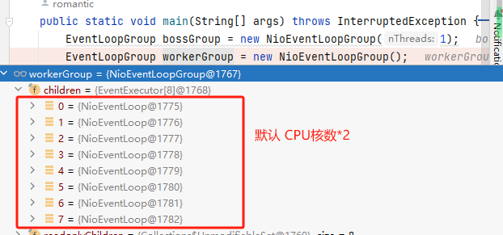
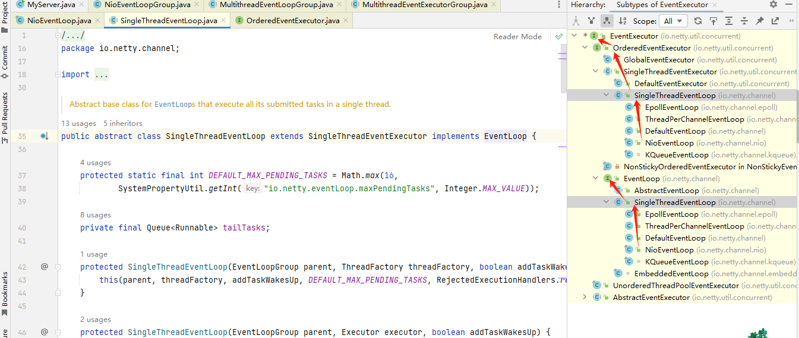
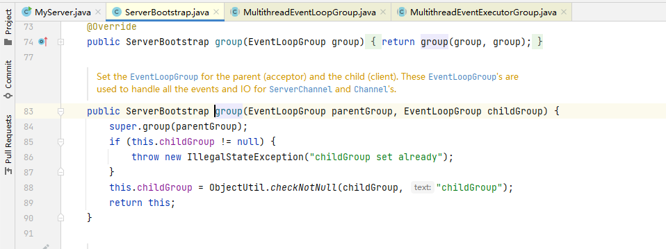

# 基本说明

1) 只有看过Netty源码，才能说是真的掌握了Netty框架。

2) 在 io.netty.example.echo 包下，有很多Netty源码案例，可以用来分析

## Netty 启动过程源码剖析

### 源码剖析

1）源码需要剖析到Netty 调用doBind方法，追踪到 NioServerSocketChannel的doBind

2）并且要Debug 程序到 NioEventloop类的<font color = 'red'>run代码，无限循环</font>，在服务器端运行。

### 说明

重点分析下创建了两个EventLoopGroup 对象:

```java
EventLoopGroup bossGroup = new NioEventLoopGroup(1);
EventLoopGroup workerGroup = new NioEventLoopGroup();
```

1. 这两个对象是整个 Netty 的核心对象，可以说，整个 Netty 的运作都依赖于他们。bossGroup 用于接受Tcp 请求，他会将请求交给 workerGroup ，workerGroup 会获取到真正的连接，然后和连接进行通信，比如读写解码编码等操作。

2. EventLoopGroup 是 事件循环组(线程组) ，含有多个EventLoop，可以注册 channel，用于在事件循环中去进行选择(和选择器相关).。[debug看]

   **事件循环组：**

   

   

   **EventLoop中的选择器：**

   

   

3. EventLoopGroup bossGroup = new NioEventLoopGroup(1); 这个1表示 bossGroup 事件组有1个线程你可以指定，如果new NioEventLoopGroup(); 表示会含有默认个线程 （cpu 核数*2），即可以充分的利用多核的优势

   在源码中一直向里面追溯会看到判断是否声明了线程数量：

   

   而 DEFAULT_EVENT_LOOP_THREADS 又是在静态代码块中初始化的

   

   接着向下断点，点击super进入到父类，它里面会创建 EventExecutor[]数组，声明如下：private final EventExecutor[] children; 

   **代码如下：**

   

   **children[i]的创建过程如下：**

   

   由 MultithreadEventExecutorGroup.java 源码我们可以得知，children[i] 每个元素的类型就是 NioEventLoop，NioEventLoop 实现了 EventLoop 接口和 Executor接口

   

   children 线程组创建完成之后，会给他们都加一个监听，源码：MultithreadEventExecutorGroup.java

   

   EventExecutor[]数组创建完成后，来到我们自己的main方法中，执行try代码块创建了一个ServerBootstrap 对象，他是一个引导类，用于启动服务器和引导整个程序的初始化。它和 ServerChannel 关联，而 ServerChannel 继承了 Channel，有一些方法remoteAddress等

   

   随后 serverBootstrap 调用了group 方法将两个 group 放入到自己的字段中

   

4. 然后添加了一个 channel，其中参数是一个 Class 对象，引导类将通过这个 Class 对象反射创建Channelfactony。然后添加了一些 TCP的参数。

   **通过反射创建channelFactory:**

   

   

   [说明：Channel 的创建在 bind 方法，可以 Debug下 bind,会找到 channel=channelFactory.newChannel();]

   ```java
   serverBootstrap.bind(7001).sync();
   ```

   

5. 再添加了一个服务器专属的日志处理器 handler。

6. 再添加一个SocketChannel(不是ServerSocketChannel)的 handler。

7. 然后绑定端口并阻塞巨连接成功。

8. 最后 main 线程阻塞等待关闭。

9. finally 块中的代码将在服务器关闭时优雅关闭所有资源

## NioEventLoopGroup 源码剖析

```java
/**
 * nThreads 使用的线程数，默认CPU核数*2
 * executor 执行器:如果传入 nu1,则采用 Netty 默认的线程工厂和默认的执行器 ThreadPerTaskExecutor
 * chooserFactory 单例 new DefaultEventExecutorChooserFactory()
 * args 在创还能执行器的时候传入的固定参数
 */
protected MultithreadEventExecutorGroup(int nThreads, Executor executor,
                                            EventExecutorChooserFactory chooserFactory, Object... args) {
    checkPositive(nThreads, "nThreads");

    // 如果传入的执行器是空的则采用默认的线程工厂和默认的执行器
    if (executor == null) {
        executor = new ThreadPerTaskExecutor(newDefaultThreadFactory());
    }

    // 创建指定线程数的执行器数组
    children = new EventExecutor[nThreads];
    // 初始化线程数组
    for (int i = 0; i < nThreads; i ++) {
        boolean success = false;
        try {
            // 创建 new NioEventLoop
            children[i] = newChild(executor, args);
            success = true;
        } catch (Exception e) {
            // TODO: Think about if this is a good exception type
            throw new IllegalStateException("failed to create a child event loop", e);
        } finally {
            // 如果创建失败，则优雅关闭
            if (!success) {
                for (int j = 0; j < i; j ++) {
                    children[j].shutdownGracefully();
                }

                for (int j = 0; j < i; j ++) {
                    EventExecutor e = children[j];
                    try {
                        while (!e.isTerminated()) {
                            e.awaitTermination(Integer.MAX_VALUE, TimeUnit.SECONDS);
                        }
                    } catch (InterruptedException interrupted) {
                        // Let the caller handle the interruption.
                        Thread.currentThread().interrupt();
                        break;
                    }
                }
            }
        }
    }

    chooser = chooserFactory.newChooser(children);

    final FutureListener<Object> terminationListener = new FutureListener<Object>() {
        @Override
        public void operationComplete(Future<Object> future) throws Exception {
            if (terminatedChildren.incrementAndGet() == children.length) {
                terminationFuture.setSuccess(null);
            }
        }
    };

    // 为每一个单例线程池添加一个关闭监听器
    for (EventExecutor e: children) {
        e.terminationFuture().addListener(terminationListener);
    }

    Set<EventExecutor> childrenSet = new LinkedHashSet<EventExecutor>(children.length);
    // 将所有单例线程池添加到一个 LinkedHashSet 中
    Collections.addAll(childrenSet, children);
    readonlyChildren = Collections.unmodifiableSet(childrenSet);
}
```

### 说明：

1）如果 executor 是null，创建一个默认的  ThreadPerTaskExecutor执行器 ,使用 Netty 默认的线程工厂

2）根据传入的线程数(CPU*2)创建一个线程池(单例线程池)数组。

3）循环填充数组中的元素。如果异常，则关闭所有的单例线程。

4）根据线程选择工厂创建一个 线程选择器。

5）为每一个单例线程池添加一个关闭监听器。

6）将所有的单例线程池添加到一个 Hashset中。

## ServerBootstrap 源码剖析

