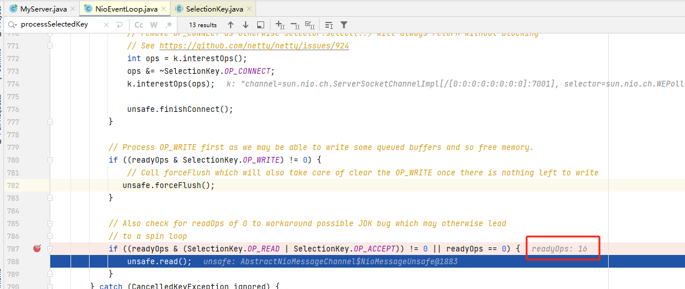
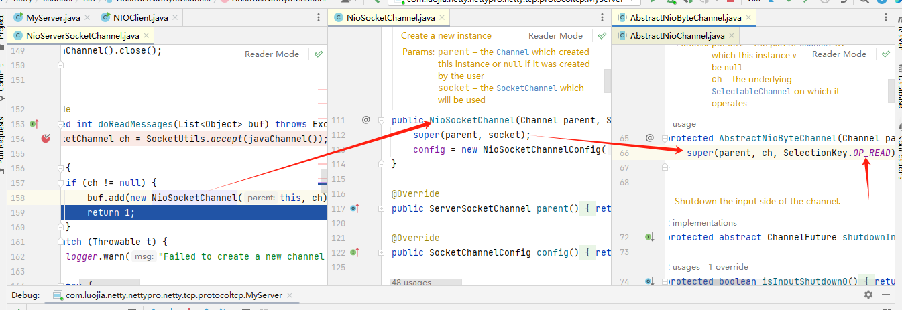
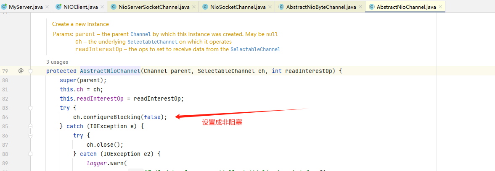
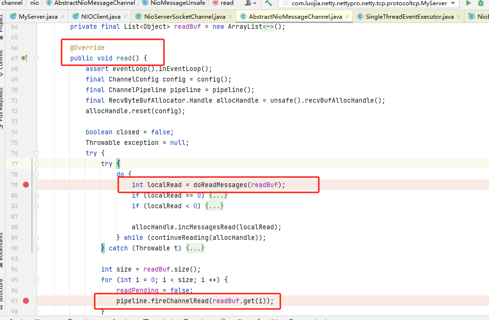
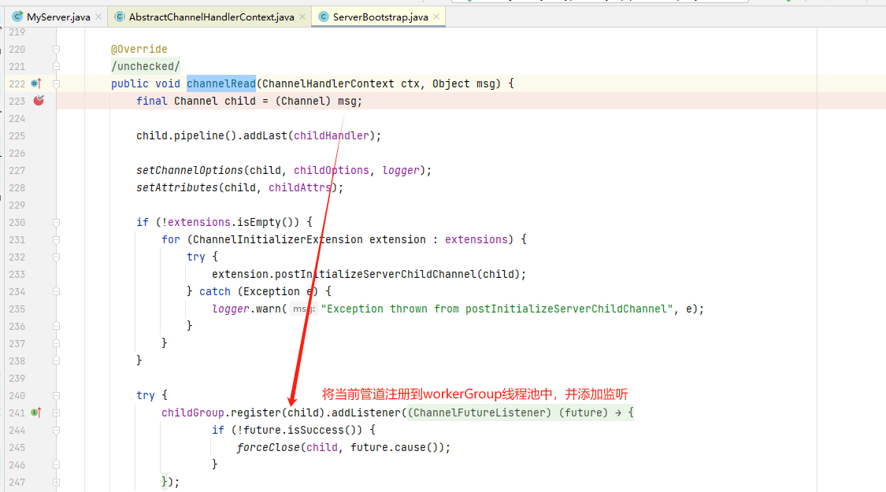
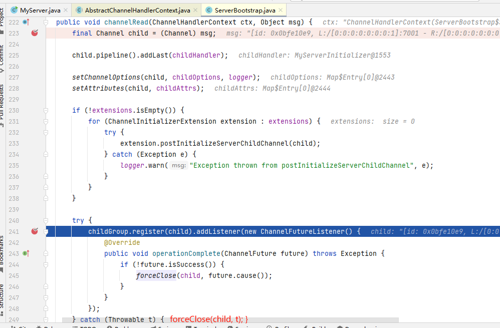

### 源码剖析

1)从之前服务器启动的源码中，我们得知，服务器最终注册了一个 Accept 事件等待客户端的连接。我们也知道，NioServerSocketChannel 将自己注册到了boss单例线程池(reactor线程)上，也就是EventLoop。

2)先简单说下EventLoop的逻辑(后面详细讲解EventLoop)

EventLoop的作用是一个死循环，而这个循环中做3件事情:

- 有条件的等待 Nio 事件。
- 处理 Nio 事件。
- 处理消息队列中的任务。

3)进入到NioEventLoop源码中后，在private void processSelectedKey(SelectionKey k, AbstractNioChannel ch)方法开始调试

---

在 NioEventLoop类下，processSelectedKey方法打上断点，浏览器执行 http://localhost:7001, 客户端发出请求

从断点我们可以看到，readyOps 是16，可就是 Accept事件，说明浏览器请求已经进来了。

这个unsafe 是boss线程中 NioServerSocketChannel的AbstractNioMessageChannel 的 NioMessageUnsafe对象。

我们进入到 AbstactNioMessageChannel 的 NioMessageUnsafe的read 方法中

.jpg)

1）检查读 eventloop 线程是否是当前线程。assert eventLoop().inEventLoop()

2）执行 doReadMessages 方法，并传入一个 readBuf 变量，这个变量是一个 List，也就是容器。

3）循环容器，执行 pipeline.fireChannelRead(readBuf.get(i));

4）doReadMessages 是**读取 boss 线程中的 NioServerSocketChannel 接受到的请求**。并把这些请求放进容器。

5）循环遍历容器中的所有请求，调用 pipeline 的 fireChannelRead 方法，用于处理这些接受的请求或者其他事件，在read 方法中，循环调用 ServerSocket的 pipeline的 fireChannelRead 方法,开始执行 管道中的handler的ChannelRead 方法

此时的ch对象还是一个 SocketChannel 对象

#### 追踪一下 doReadMessages() 方法

经过158行包装之后，变成一个 NioSocketChannel 对象并加入到buf 这个list中

**总结说明：**

- 通过工具类，调用 NioServerSocketChannel 内部封装的 serverSocketChannel 的 accept 方法(154行)，这是 Nio 做法。
- 获取到一个 JDK 的 SocketChannel，然后，使用 NioSocketChannel 进行封装。最后添加到容器中
- 这样容器 buf 中就有了 NioSocketChannel，通过断点追踪，发现在 new NioSocketChannel(this, ch) 方法中，它会将当前请求设置成 SelectionKey.OP_READ 读状态并且设置成非阻塞的，这和之前自己写的Nio流程是一样的。

6）回到 read方法，继续分析循环执行 pipeline.fireChannelRead(readBuf.get(i)) 方法

.jpg)

- 前面分析 doReadMessages 方法的作用是通过 ServerSocket 的 accept 方法获取到 Tcp 连接，然后封装成Netty 的 NioSocketChannel 对象。最后添加到容器中

- 在read 方法中,循环调用 ServerSocket的 pipeline 的 fireChanneRead 方法,开始执行 管道中的 handleChannclRead 方法(debug 进入)

  

- 经过Debug，可以看到会反复执行多个 handler 的channelRead，其中有一个很重要的handler，ServerBootstrapAcceptor，搜索 ServerBootstrapAcceptor 类(他是ServerBootstrap 的静态内部类)，找到channelRead 方法，它会将客户端连接注册到 worker线程池

channelRead 整体方法：

说明:

- msg强转成Channel，实际上就是 NioSocketChannel
- 添加 NioSocketChannel的 pipeline 的 handler ，就是我们 main 方法里面设置的 childHandler 方法里的handler 
- 设置 NioSocketChannel 的各种属性。
- 将该 NioSocketChannel 注册到 childGroup 中的一个 EventLoop 上，并添加一个监听器。
- 这个 childGroup 就是我们 main 方法创建的数组workerGroup。

7）进入到register 方法注册，执行管道中可能存在的任务

8）最终会调用doBeginRead 方法，也就是 AbstractNioChannel 类的方法，执行到这里时，针对这个客户端的连接就完成了，接下来就可以监听读事件了。

