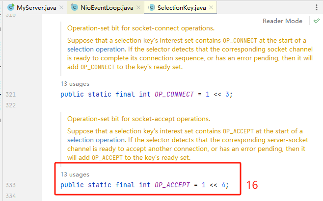
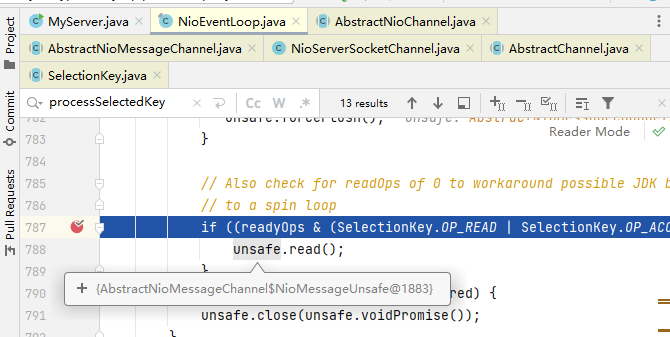
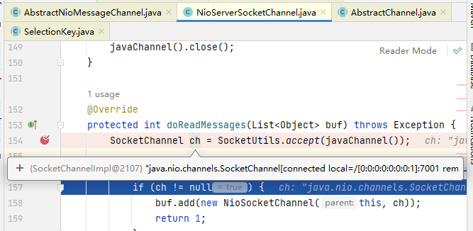

# 源码剖析

从之前服务器启动的源码中，我们得知，服务器最终注册了一个 Accept 事件等待客户端的连接。我们也知道，NioServerSocketChannel 将自己注册到了boss单例线程池(reactor线程)上，也就是EventLoop。

## Accept 剖析

### NIO中处理Accept事件流程

NIO中处理Accept事件主要有以下六步

1. selector.select() 阻塞线程，直到事件发生
2. 遍历 selectionKeys
3. 获取一个 key，判断事件类型是否为Accept
4. 创建 SocketChannel ，设置为非阻塞
5. 将 SocketChannel 注册到 selector 中
6. 关注 selectionKeys 的 read 事件

代码如下

```java
// 阻塞直到事件发生
selector.select();

Iterator<SelectionKey> iter = selector.selectionKeys().iterator();
while (iter.hasNext()) {    
    // 拿到一个事件
    SelectionKey key = iter.next();
    
    // 如果是 accept 事件
    if (key.isAcceptable()) {
        
        // 执行accept，获得SocketChannel
        SocketChannel channel = serverSocketChannel.accept();
        channel.configureBlocking(false);
        
        // 将SocketChannel注册到selector中，并关注read事件
        channel.register(selector, SelectionKey.OP_READ);
    }
    // ...
}
```

**其中前三步，在NioEventLoop剖析中已经分析过了，所以接下来主要分析后三步**

### SocketChannel的创建与注册

先简单说下EventLoop的逻辑(后面详细讲解EventLoop)

EventLoop的作用是一个死循环，而这个循环中做3件事情:

- 有条件的等待 Nio 事件。
- 处理 Nio 事件。
- 处理消息队列中的任务。

进入到 NioEventLoop 源码中后，在 private void processSelectedKey(SelectionKey k, AbstractNioChannel ch)方法开始调试

---

在 NioEventLoop类下，processSelectedKey方法打上断点，浏览器执行 http://localhost:7001, 客户端发出请求




从断点我们可以看到，readyOps 是16，可就是 Accept事件，说明浏览器请求已经进来了。

这个unsafe 是boss线程中 NioServerSocketChannel的AbstractNioMessageChannel 的 NioMessageUnsafe对象。



我们进入到 AbstactNioMessageChannel 的 NioMessageUnsafe的read 方法中

.jpg)

```java
public void read() {

    ...
    
    try {
        try {
            do {
				// doReadMessages中执行了accept获得了SocketChannel
                // 并创建NioSocketChannel作为消息放入readBuf
                // readBuf是一个ArrayList用来缓存消息
                // private final List<Object> readBuf = new ArrayList<Object>();
                int localRead = doReadMessages(readBuf);
                
                ...
                
				// localRead值为1，就一条消息，即接收一个客户端连接
                allocHandle.incMessagesRead(localRead);
            } while (allocHandle.continueReading());
        } catch (Throwable t) {
            exception = t;
        }

        int size = readBuf.size();
        for (int i = 0; i < size; i ++) {
            readPending = false;
            // 触发read事件，让pipeline上的handler处理
            // ServerBootstrapAcceptor.channelRead
            pipeline.fireChannelRead(readBuf.get(i));
        }
        
        ...
        
    } finally {
        if (!readPending && !config.isAutoRead()) {
            removeReadOp();
        }
    }
}
```

1）检查读 eventloop 线程是否是当前线程。assert eventLoop().inEventLoop()

2）执行 doReadMessages 方法，并传入一个 readBuf 变量，这个变量是一个 List，也就是容器。

3）循环容器，执行 pipeline.fireChannelRead(readBuf.get(i));

4）doReadMessages 是**读取 boss 线程中的 NioServerSocketChannel 接受到的请求**。并把这些请求放进容器。

5）循环遍历容器中的所有请求，调用 pipeline 的 fireChannelRead 方法，用于处理这些接受的请求或者其他事件，在read 方法中，循环调用 ServerSocket的 pipeline的 fireChannelRead 方法,开始执行 管道中的handler的ChannelRead 方法

此时的ch对象还是一个 SocketChannel 对象

#### 追踪一下 doReadMessages() 方法



经过158行包装之后，变成一个 NioSocketChannel 对象并加入到buf 这个list中

```java
@Override
protected int doReadMessages(List<Object> buf) throws Exception {
    // 处理accpet事件，获得SocketChannel
    SocketChannel ch = SocketUtils.accept(javaChannel());

    try {
        if (ch != null) {
            // 创建了NioSocketChannel，并且作为消息放在了readBuf中
            buf.add(new NioSocketChannel(this, ch));
            return 1;
        }
    } catch (Throwable t) {
       ...
    }

    return 0;
}
```


**总结说明：**

- 通过工具类，调用 NioServerSocketChannel 内部封装的 serverSocketChannel 的 accept 方法(154行)，这是 Nio 做法。
- 获取到一个 JDK 的 SocketChannel，然后，使用 NioSocketChannel 进行封装。最后添加到容器中
- 这样容器 buf 中就有了 NioSocketChannel，通过断点追踪，发现在 new NioSocketChannel(this, ch) 方法中，它会将当前请求设置成 SelectionKey.OP_READ 读状态并且设置成非阻塞的，这和之前自己写的Nio流程是一样的。


6）回到 read方法，继续分析循环执行 pipeline.fireChannelRead(readBuf.get(i)) 方法

.jpg)

- 前面分析 doReadMessages 方法的作用是通过 ServerSocket 的 accept 方法获取到 Tcp 连接，然后封装成Netty 的 NioSocketChannel 对象。最后添加到容器中

- 在read 方法中,循环调用 ServerSocket的 pipeline 的 fireChanneRead 方法,开始执行 管道中的 handleChannelRead 方法(debug 进入)

  

- 经过Debug，可以看到会反复执行多个 handler 的channelRead，其中有一个很重要的handler，ServerBootstrapAcceptor，搜索 ServerBootstrapAcceptor 类(他是ServerBootstrap 的静态内部类)，找到channelRead 方法，它会将客户端连接注册到 worker线程池


channelRead 整体方法：


<font color = 'orange'>`ServerBootstrapAcceptor.channelRead`</font>

```java
public void channelRead(ChannelHandlerContext ctx, Object msg) {
    // 这时的msg是NioSocketChannel
    final Channel child = (Channel) msg;

    // NioSocketChannel添加childHandler，即初始化器
    child.pipeline().addLast(childHandler);

    // 设置选项
    setChannelOptions(child, childOptions, logger);

    for (Entry<AttributeKey<?>, Object> e: childAttrs) {
        child.attr((AttributeKey<Object>) e.getKey()).set(e.getValue());
    }

    try {
        // 注册 NioSocketChannel到nio worker线程，接下来的处理也移交至nio worker线程
        childGroup.register(child).addListener(new ChannelFutureListener() {
            @Override
            public void operationComplete(ChannelFuture future) throws Exception {
                if (!future.isSuccess()) {
                    forceClose(child, future.cause());
                }
            }
        });
    } catch (Throwable t) {
        forceClose(child, t);
    }
}
```

说明:

- msg强转成Channel，实际上就是 NioSocketChannel
- 添加 NioSocketChannel的 pipeline 的 handler ，就是我们 main 方法里面设置的 childHandler 方法里的handler 
- 设置 NioSocketChannel 的各种属性。
- 将该 NioSocketChannel 注册到 childGroup 中的一个 EventLoop 上，并添加一个监听器。
- 这个 childGroup 就是我们 main 方法创建的数组workerGroup。

7）进入到register 方法注册，执行管道中可能存在的任务

通过`AbstractUnsafe.register` 方法，将SocketChannel注册到了Selector中，**过程与启动流程中的Register过程类似**

```java
public final void register(EventLoop eventLoop, final ChannelPromise promise) {
    
    ...

    AbstractChannel.this.eventLoop = eventLoop;

    if (eventLoop.inEventLoop()) {
        register0(promise);
    } else {
        try {
            // 这行代码完成的是nio boss -> nio worker线程的切换
            eventLoop.execute(new Runnable() {
                @Override
                public void run() {
                    // 真正的注册操作
                    register0(promise);
                }
            });
        } catch (Throwable t) {
            ...
        }
    }
}
```

<font color = 'orange'>`AbstractChannel.AbstractUnsafe.register0`</font>

```java
private void register0(ChannelPromise promise) {
    try {
        
        ...
            
        // 该方法将SocketChannel注册到Selector中
        doRegister();
        
        // 执行初始化器，执行前 pipeline 中只有 head -> 初始化器 -> tail
        pipeline.invokeHandlerAddedIfNeeded();
        // 执行后就是 head -> my handler -> tail

        safeSetSuccess(promise);
        pipeline.fireChannelRegistered();
        
        if (isActive()) {
            if (firstRegistration) {
                // 触发pipeline上active事件
                pipeline.fireChannelActive();
            } else if (config().isAutoRead()) {
                beginRead();
            }
        }
    } catch (Throwable t) {
        closeForcibly();
        closeFuture.setClosed();
        safeSetFailure(promise, t);
    }
}
```

`AbstractNioChannel.doRegister`将SocketChannel注册到Selector中

```java
@Override
protected void doRegister() throws Exception {
    boolean selected = false;
    for (;;) {
        try {
            // 将Selector注册到Selector中
            selectionKey = javaChannel().register(eventLoop().unwrappedSelector(), 0, this);
            return;
        } catch (CancelledKeyException e) {
            ...
        }
    }
}
```

<font color = 'orange'>`HeadContext.channelActive`</font>

```java
public void channelActive(ChannelHandlerContext ctx) {
    ctx.fireChannelActive();
	// 触发read(NioSocketChannel这里read只是为了触发channel的事件注册，还未涉及数据读取)
    readIfIsAutoRead();
}
```

8）最终会调用doBeginRead 方法，也就是 AbstractNioChannel 类的方法，执行到这里时，针对这个客户端的连接就完成了，接下来就可以监听读事件了。


#### Netty接受请求过程梳理

<font color = 'red'>总体流程：</font>接受连接 -----> 创建一个新的NioSocketChannel -----> 注册到一个worker EventLoop -----> 注册selector Read 事件。

- 服务器轮询Accept事件，获取事件后调用 unsafe 的 read 方法，这个 unsafe 是ServerSocket 的内部类，该方法内部由2部分组成
- doReadMessages用于创建 NioSocketChannel对象，该对象包装JDK的Nio Channel 客户端。该方法会像创建 ServerSocketChannel 类似创建相关的 pipeline，unsafe, config
- 随后执行 pipeline.firechannelRead 方法，并将自己绑定到一个 chooser 选择器选择的 workerGroup 中的一个EventLoop。并且注册一个0，表示注册成功，但并没有注册读(1)事件