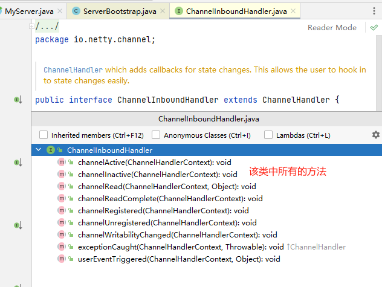
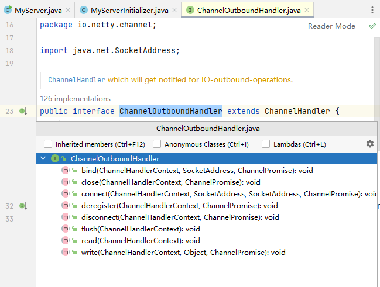
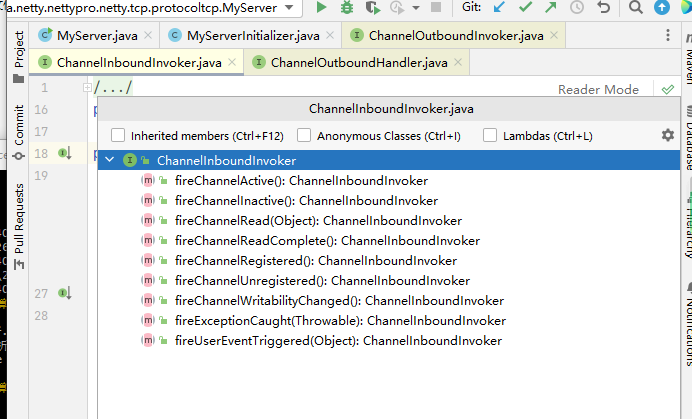

# 源码剖析

Netty中的 ChannelPipeline、ChannelHandler 和 ChannelHandlerContext 是非常核心的组件，我们从源码来分析Netty 是如何设计这三个核心组件的，并分析是如何创建和协调工作的。

### ChannelPipeline、ChannelHandler、ChannelHandlerContext 介绍

1)每当 ServerSocket 创建一个新的连接，就会创建一个 Socket，对应的就是目标客户端。

2)每一个新创建的 Socket，都将会分配一个全新的 ChannelPipeline（以下简称 pipeline）

3)每一个 ChannelPipeline 内部都含有多个 ChannelHandlerContext(以下简称 Context)

4)**他们一起组成了双向链表**，这些Context 用于包装我们调用 addLast方法时添加的 ChannelHandler(以下简称handler )


- 上图中：ChannelSocket 和  ChannePipeline 是一对一的关联关系，而 pipeline 内部的多个 Context 形成了链表，**Context只是对Handler的封装**
- 当一个请求进来的时候，会进入 Socket 对应的 pipeline，并经过 pipeine 所有的 handle，这就是设计模式中的过滤器模式(一般和责任链模式一起)。

### ChannelPipeLine 作用及设计

pipeline 的接口设计


可以看到该接口继承了 inBound，outBound，Iterable 接口，表示他可以调用**数据出站的方法和入站**的方法，同时也能遍历内部的链表， 看看他的几个代表性的方法，基本上都是针对 handler 链表的插入，追加，删除，替换操作，类似是一个 LinkedList。同时，也能返回 channel(也就是 socket)

1）在 pipeline 的接口文档上，提供了一幅图


**对上图的解释说明：**

这是一个 handler 的 list，handler 用于处理或拦截入站事件和出站事件，pipeline 实现了过滤器的高级形式，以便用户控制事件如何处理以及 handler在pipeline 中如何交互。

上图指述了一个典型的 handler在pipeline中处理I/O事件的方式，IO事件由 inboundhandler 或者 outBoundHandler 处理，并通过调用 channelHandlerContext.fireChannelRead（以 inboundhandler 为例） 方法转发给其最近的处理程序


入站事件由入站处理程序以自下而上的方向处理，如上链表图所示。入站处理程序通常处理由图底部的 I/O 线程生成入站数据。入站数据通常从如 SocketChannel.read(ByteBuffer)获取。

通常一个 pipeline 有多个 handler，例如，一个典型的服务器在每个通道的管道中都会有以下处理程序

​	协议解码器 - 将二进制数据转换为 Java 对象。

​	协议编码器 - 将Java 对象转换为二进制数据。

​	业务逻辑处理程序 - 执行实际业务逻辑(例如数据库访问)

你的业务程序不能将线程阻塞，会影响 IO 的速度，进而影响整个 Netty 程序的性能。如果你的业务程序很快，就可以放在 IO 线程中，反之，你需要异步执行。或者在添加 handler 的时候添加一个线程池，例如:

// 下面这个任务执行的时候，将不会阻塞 IO 线程，执行的线程来自 group 线程池  pipeline,addLast(group, “handler", new lyBusinessLogicHandler())

### ChannelHandler 作用及设计

源码解读：

```java
public interface ChannelHandler {

    // 当把 ChannelHandler 添加到 pipeline 时被调用
    void handlerAdded(ChannelHandlerContext ctx) throws Exception;

    // 当从 pipeline 中移除时被调用
    void handlerRemoved(ChannelHandlerContext ctx) throws Exception;

    // 当处理过程中在 pipeline 发生异常时调用
    @Deprecated
    void exceptionCaught(ChannelHandlerContext ctx, Throwable cause) throws Exception;

}
```

Channelhandler 的作用就是处理 IO 事件或拦截 IO 事件，并将其转发给下一个处理程序 ChannelHandler。Handler 处理事件时分入站和出站的，两个方向的操作都是不同的，因此，Netty 定义了两个子接口继承ChannelHandler

- ChannelInboundHandler 入站事件接口

  

  channelActive 用于当 Channel 处于活动状态时被调用；

  channelRead 当从 Channel 读取数据时被调用，等等其他方法。

  程序员需要重写一些方法，当发生关注的事件，需要在方法中实现我们的业务逻辑，因为当事件发生时，Netty 会回调对应的方法。

- ChannelOutboundHandler 出站事件接口

  

  bind 方法，当请求将 Channel 绑定到本地地址时调用

  close 方法，当请求关闭 Channel 时调用等等

  出站操作都是一些连接和写出数据类似的方法

- ChannelDuplexHandler 处理出站和入站事件

  

  ChannelDuplexHandler : 间接实现了入站接口并直接实现了出站接口。

  是一个通用的能够同时处理入站事件和出站事件的类。

### ChannelHandlerContext 作用及设计

ChannelHandlerContext UML图


ChannelHandlerContext 继承了出站方法调用接口和入站方法调用接口

1) ChannelOutboundInvoker和 ChannelInboundInvoker部分源码




这两个 invoker 就是针对入站或出站方法来的，就是在 入站或出站 handler 的外层再包装一层，达到在方法前后拦截并做一些特定操作的目的

2）ChannelHandlerContext 部分源码


ChannelHandlerContext 不仅仅继承了他们两个的方法，同时也定义了一些自己的方法

这些方法能够获取 Context 上下文环境中对应的比如 channel，executor，handler，pipeline，内存分配器，关联的 handler 是否被删除。

Context 就是包装了 handler 相关的一切，以方便 Context 可以在 pipeline 方便的操作 handler

### ChannelPipeline | ChannelHandler | ChannelHandlerContext 创建过程

#### 分为3个步强来看创建的过程:

任何一个 ChannelSocket 创建的同时都会创建一个 pipeline。

当用户或系统内部调用 pipeline的 add***方法添加 handler 时，都会创建一个包装这 handler 的 Context。

这些 Context 在 pipeline 中组成了双向链表。

#### Socket 创建的时候创建 Pipeline

他是在 serverBootstrap.bind(7001) 里面创建的，bind里面实际上调用的事dobind方法，里面会调用 initAndRegister 方法， initAndRegister  方法通过无参构造器反射得到NioserverSocketChannel对象，然后一直去到他的父类 AbstractChannel，在这里面创建的Pipeline

```Java
protected AbstractChannel(Channel parent) {
    this.parent = parent;
    id = newId();
    unsafe = newUnsafe();
    pipeline = newChannelPipeline();
}

protected DefaultChannelPipeline newChannelPipeline() {
    return new DefaultChannelPipeline(this);
}

protected DefaultChannelPipeline(Channel channel) {
    this.channel = ObjectUtil.checkNotNull(channel, "channel");
    succeededFuture = new SucceededChannelFuture(channel, null);
    voidPromise =  new VoidChannelPromise(channel, true);

    tail = new TailContext(this);
    head = new HeadContext(this);

    head.next = tail;
    tail.prev = head;
}
```

